# 거짓 전제 교정과 정상 질문 보존에 관한 연구 진행 보고

2026년 10월 6일 교수님 발표 · 논문 구성에 맞춘 발표 원고

**연구 목표는 FPQ의 필요한 교정과 NFP의 정상 응답 보존을 함께 개선하는 방법을 만드는 것입니다.** 기존 논문이 제시한 원인 설명을 방법 설계의 근거로 삼고, 필요한 분석과 대조 실험은 개선할 지점을 선택하고 방법의 효과를 설명하는 데 사용합니다.

지난 발표 이후에는 GPT-6 Luna에서 CREPE·Cancer-Myth의 Plain·답변 GEPA 평가를 마쳤고, Cancer-Myth에서는 Well 공개 구현의 PreWoMe·Extract+Verify를 적용했습니다. 이번 본문은 기존 연구의 설명, 기존 방법의 실제 답변 성능, 남아 있는 문제와 다음 개선 방향을 중심으로 보고합니다. 수동으로 바꿔 본 검증·답변 조건은 탐색 기록으로 부록에 보존합니다. **현재는 최종 방법을 개발·선택하는 단계입니다.** 검증기는 시험 중인 수단 중 하나이며, 원인 가설의 검증 자체를 연구 목표로 삼거나 공통 원인을 모두 규명해야 방법을 제안할 수 있다고 전제하지 않습니다.

수치는 저장된 결과 파일을 대조했습니다. 표의 FPQ 교정·NFP 보존은 별도 표시가 없으면 **실제 답변의 Well 점수 ≥4 비율**입니다. 전자는 필요한 교정과 답변, 후자는 정상 질문에 대한 응답을 평가하는 지표이며, NFP 4점 미만을 모두 의학적으로 부당한 반박으로 확정하지 않습니다. 논문의 TPQ는 표에서 NFP로 통일했습니다.

## 지난 발표 이후 실제로 한 일

기준 발표는 [10월 2일 발표 원고](43_advisor_meeting_script_2026-10-02.md)입니다. 이전의 네 모델 답변 3,659쌍 집계·선정 299쌍 독해와 아래의 GPT-6 Luna 후속 실험을 별개로 구분합니다. 아래 항목 사이에는 재사용한 문항·답변이 있으므로 개수를 합해 독립 표본 수로 보고하지 않습니다.

| 작업 | 실제 수행한 내용 | 10월 6일 확인 상태 |
|---|---|---|
| 일반·의료 도메인 비교 | CREPE 3,004문항과 Cancer-Myth 200문항에서 Plain·답변 GEPA 생성 및 채점 | **6,408개 답변 평가 완료** |
| GEPA의 의료 지시 점검 | Cancer-Myth에서 개인 진단·예후를 일반 정보와 구분하라는 문구 한 항목을 삭제 | **200문항 완료**. FPQ 79→83%, NFP 72→72%, 단일 실행 |
| 공개 파이프라인 적용 | Well 공개 코드의 PreWoMe와 Extract+Verify를 Luna에 연결 | **각 200문항 완료**. few-shot 중복 1개를 제외한 공통 199문항이 주 비교 |
| 파이프라인 실패 분석 | NFP 100문항의 질문·공유 추출·두 방법의 검토·답변을 직접 대조. 남은 FPQ 실패도 대조 | **독해 기록 완료**. 임상 전문가의 독립 판정은 아님 |
| 보조 탐색 기록 | 검증·답변 지시를 변경한 조건과 실패 전환 대조 | **개발 자료에서 평가·독해 완료**. 최종 방법이 아니므로 조건·수치·사례는 부록 A1–A3에 보존 |
| 실행·채점 변동 확인 | 같은 검증 결과에서 점수 경계가 바뀐 36쌍 독해, 저장 답변 재채점 | **36쌍 독해 및 추가 재채점 240회 완료** |
| 답변 반복·판정 정보 진단 | 기존 실행의 반복과 판정 정보 교체 비교 | **최종 비교 미완료**. 세부 조건과 진행 기록은 부록 A4–A5 |
| 검증기 GEPA | 답변 지시 대신 검증 지시만 최적화 | **최종 비교 미완료**, 성능 개선 여부는 아직 보고할 수 없음 |
| 문헌 재정리 | FPQ 실패, 개입의 trade-off, 특정 방법 실패를 구분 | 최신 검토 17편을 포함해 원인 가설·개입 근거·적용 범위 정리 |

**진행 상태 주의:** 미완료 실험의 중간 평가 횟수를 최종 성능으로 제시하지 않습니다. 10월 6일 재개 후에도 연결 전환 오류로 중단된 기록이 있으며, 실제 진행 여부는 결과 상태 파일을 기준으로 확인합니다.

**발표 시작 문장**

> 저희 목표는 잘못된 전제를 교정하면서 정상 질문에는 불필요하게 반박하지 않는 방법을 만드는 것입니다. 지난 발표 이후에는 기존 연구의 원인 설명과 해결책을 정리하고, GEPA와 두 전제 검토 방법을 실제 답변 과제에 적용했습니다. 이번에 보여드릴 것은 기존 방법이 두 성능을 얼마나 함께 만족하는지, 어떤 문제가 남았는지, 그리고 문헌의 설명을 바탕으로 무엇을 개선하려는지입니다. 수동 지시 변경의 세부 결과는 보조 자료로 두었습니다.

## 1 Introduction

### 슬라이드 1 Motivation 왜 필요한 교정과 정상 응답을 함께 다뤄야 하는가

**슬라이드 맨 위 문장: 잘못된 전제를 고치는 능력과 정상 질문에 그대로 잘 답하는 능력을 함께 높여야 합니다.**

사용자는 질문에 사실뿐 아니라 자신의 믿음과 추론을 함께 담습니다. 모델이 요청 수행에만 집중하면 틀린 가정을 강화할 수 있습니다. 반대로 모든 내용을 적극적으로 의심하면 정상적인 질문에도 불필요하게 반박해 사용자가 요청한 도움을 제공하지 못할 수 있습니다. 실제 QA에 필요한 것은 오류 지적의 빈도를 높이는 것이 아니라 **교정이 필요한 내용은 고치고, 나머지 요청에는 적절하게 답하는 능력**입니다.

| 질문 | 필요한 답변 행동 | 실패 |
|---|---|---|
| FPQ: 질문이 틀린 주장에 의존함 | 그 주장을 바로잡고, 가능한 요청에도 답함 | 틀린 가정을 받아들인 채 요청만 수행하거나, 다른 주장만 반박함 |
| NFP: 불필요한 교정이 필요 없는 질문 | 주어진 맥락에 맞게 답하고 필요한 한계만 설명함 | 질문에 없는 오류를 만들어 반박하거나, 확인할 수 없다는 이유로 응답을 흐림 |

**보존**은 주석이나 사용자의 모든 말을 무조건 참으로 선언하는 것이 아닙니다. 질문에 없는 더 강한 주장을 만들어 반박하지 않고, 주어진 맥락에서 요청에 실질적으로 답한다는 뜻입니다. 일반적인 주의사항이나 “그런 서비스는 없습니다”라는 정상적인 부정 답변도 자동으로 오반박이 되지 않습니다.

**발표 설명**

> FPQ만 잘하는 모델을 만들려는 것이 아닙니다. 오류를 더 적극적으로 찾게 했을 때 정상 질문까지 잘못됐다고 말하면, 실제 사용자에게는 새로운 문제가 생깁니다. 따라서 최종 목표는 두 종류의 질문에 모두 적절하게 답하는 것입니다. 별도 탐지 점수는 그 목표를 달성하는 방법을 진단하는 보조 지표입니다.

### 슬라이드 2 Problem 기존 방법으로 무엇이 부족한가

**슬라이드 맨 위 문장: FPQ 교정을 높이는 것만으로는 좋은 답변 방법이 되지 않습니다. 정상 질문의 응답도 함께 보존해야 합니다.**

| 방법 | FPQ 교정 ≥4 | NFP 보존 ≥4 |
|---|---|---|
| Plain | 54.5% | 91.0% |
| PreWoMe | 88.9% | 59.0% |
| Extract+Verify | 87.9% | 48.0% |

같은 Cancer-Myth FPQ 99개·NFP 100개, GPT-6 Luna의 단일 실행 비교입니다. 생성·채점 설정과 한계는 뒤의 실험 절에서 설명합니다.

기존 연구는 전제 검토·프롬프트 최적화·학습·내부 개입 등을 제안했고, Well Actually는 정상 질문 손상과 검증 병목도 지적했습니다. 따라서 trade-off 자체를 새로운 발견으로 내세우지 않습니다. 우리가 해결하려는 한계는 **필요한 교정을 늘리는 방법이 정상 응답까지 손상시키는 것**입니다.

**발표 설명**

> 전제를 먼저 검토하면 교정 성능은 크게 올랐지만 정상 질문 성능이 떨어졌습니다. 이 문제는 기존 연구에서도 보고됐습니다. 저희가 하려는 것은 이 현상을 다시 보여주는 데서 끝나는 것이 아니라, 기존 연구의 설명을 근거로 방법을 개선해 두 성능을 함께 높이는 것입니다.

### 슬라이드 3 Our Approach 어떤 방법을 개발하려는가

**슬라이드 맨 위 문장: 기존 연구의 원인 설명을 설계 근거로 삼아, 필요한 교정을 유지하면서 불필요한 반박을 줄이는 방법을 개발합니다.**

| 구성 | 이번 연구에서의 역할 |
|---|---|
| 기존 원인 설명과 해결책 | 무엇을 바꿔야 할지 정하는 설계 근거. 적용 범위는 Related Work에서 구분 |
| 방법 개발 | 기존 접근의 수정할 요소를 선택하고, FPQ 교정과 NFP 보존을 함께 개선하도록 설계 |
| 효과 평가 | 기존 방법 대비 실제 답변의 두 성능, 반복 실행, 다른 데이터에서의 효과를 확인 |
| 필요한 분석·ablation | 어떤 설계 요소가 도움이 되는지 설명하고 남은 실패를 수정하는 데 사용 |

현재는 기존 방법의 비교 결과와 문헌의 설명을 바탕으로 개선 방향을 선택하고 있습니다. **최종 제안법은 아직 확정하지 못했습니다.** 검증기는 후보 수단 중 하나이며, 수동으로 지시를 바꾼 조건들을 연구의 주된 방법으로 제시하지 않습니다.

완료한 작업은 기존 방법 비교, 중간 출력·실제 답변의 대조, 평가 변동 확인입니다. 추가 조건의 탐색 결과는 부록에 보존합니다. 목표로 하는 기여는 **기존 설명에 근거한 방법 개선과 FPQ·NFP의 동시 성능 향상**이며, 그 성과를 이미 달성한 것처럼 발표하지 않습니다.

**발표 설명**

> 원인 가설을 나열하고 검증하는 것 자체가 목표는 아닙니다. 문헌에서 설명한 실패 요인을 방법 설계의 근거로 삼고, 실제로 개선되는지를 보려는 것입니다. 분석은 어떤 부분을 고칠지 결정하거나 제안 방법의 효과를 설명하는 데 필요한 만큼 진행하겠습니다.

## 2 Related Work

문헌은 **FPQ 교정의 어려움 → 교정을 강화할 때 생기는 부작용 → 전제 검토 방법과 남은 문제** 순서로 설명합니다. 이는 방법 개발에 필요한 선행 근거이며, 모든 원인을 새로 검증하는 별도의 연구 목표가 아닙니다.

**Related Work 구간 안내**

| 구간 | 슬라이드 | 이 구간에서 설명할 것 |
|---|---|---|
| ① FPQ 교정의 어려움 | **4–6** | 왜 잘못된 전제를 받아들이거나, 오류를 구별할 수 있어도 답변에서 교정하지 않는가 |
| ② 교정을 강화할 때 생기는 부작용 | **7–11** | 특정 실패를 줄이는 개입이 왜 유지해야 할 정상 행동까지 손상시킬 수 있는가 |
| ③ 전제 검토 방법과 남은 문제 | **12–18** | **12–14:** 기존 방법의 검토·답변 구조 / **15–18:** 검증 병목과 절차상 한계 |

이 구간 제목은 발표 흐름을 안내하기 위한 것이며 별도의 슬라이드를 추가하지 않습니다. 슬라이드 번호는 그대로 유지합니다.

**맨 위 문장의 기준:** 각 논문이 제시한 원인 설명을 먼저 적습니다. 원인을 분리해 밝히지 않은 논문은 **원인 가설·설계 가설·방법 설계의 근거·병목 진단**으로 표시합니다. 특히 Well Actually의 과도한 거부를 그보다 아래의 원인까지 밝혀진 결과로 소개하지 않습니다.

아래는 논문별 한 장씩의 슬라이드 원고입니다. 각 장의 그림·표는 **해당 저자의 결과**이고, 우리 실험 결과는 Experimental Results에만 둡니다. 그림은 원본에서 발췌했으며 표의 일부 행·열을 옮긴 경우 그 범위를 명시했습니다. 원문 위치와 이미지 출처는 [발췌 자료 목록](reviews/advisor_update_2026-10-06/related_work_assets/README.md)에도 남겼습니다. 발표 시에는 맨 위 문장·그림/표·핵심 불릿을 띄우고, ‘발표 설명’은 읽을 원고로 사용합니다.

### 2.1 FPQ 교정의 어려움 — 슬라이드 4–6

**핵심 질문: 모델은 왜 잘못된 전제를 교정하지 않는가?** 배경 수용, 요청 수행 문맥, 사용자 동의를 선호하는 학습 신호에 관한 설명을 차례로 봅니다.

#### 슬라이드 4 Accommodation — 같은 내용도 배경에 놓이면 덜 교정한다

**논문:** [Accommodation and Epistemic Vigilance: A Pragmatic Account of Why LLMs Fail to Challenge Harmful Beliefs](https://arxiv.org/html/2601.04435v1)

**슬라이드 맨 위 문장 — 저자의 원인 설명: 모델이 사용자의 가정을 받아들여 대화를 이어가는 수용(accommodation)을 기본값으로 삼고, 필요한 경우 그 가정을 의심하는 경계(epistemic vigilance)가 충분히 작동하지 않는다는 화용론적 설명입니다.**

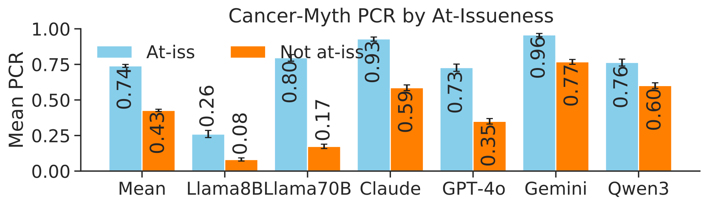

*원문 발췌: Figure 1의 Cancer-Myth 패널. 세로축은 전제 교정률(PCR), 가로축은 모델. 파랑은 주장이 직접 논의 대상인 조건, 주황은 배경에 놓인 조건입니다.*

- **그림에서 볼 것:** 여러 모델에서 주황 막대가 낮습니다. 같은 지식을 묻더라도 대화에서 주장에 부여한 지위가 교정 행동에 영향을 줍니다.
- **저자의 설명 → 방법에 참고:** 대화 배경을 일단 수용하는 성향과 충분하지 않은 사실 점검을 설명으로 제시합니다. 전제를 검토 대상으로 드러내는 접근의 근거입니다.
- **인용 범위:** 이것만으로 FPQ–NFP trade-off 전체가 설명되지는 않습니다. ‘wait a minute’은 assistant prefill이며, Table A6의 Cancer-Myth Claude-Sonnet-4에서는 교정률 0.40→0.68과 함께 오탐률도 0.09→0.17로 변합니다.

**발표 설명**

> 이 논문은 질문 속 주장을 직접 물을 때와 배경으로 둘 때를 비교했습니다. 배경에 놓이면 교정이 줄어들어, 대화상 역할이 교정을 방해할 수 있다는 설명을 제시합니다. 따라서 전제를 별도로 검토하게 하는 접근에는 선행 근거가 있습니다. 다만 그 접근이 정상 질문까지 보존하는지는 따로 확인해야 합니다. 이 논문의 교정률은 우리 Well≥4와 다른 지표입니다.

#### 슬라이드 5 Knowing but Not Correcting — 요청 수행 문맥이 교정 선택을 억제한다

**논문:** [Knowing but Not Correcting: Routine Task Requests Suppress Factual Correction in LLMs](https://arxiv.org/html/2605.05957v2)

**슬라이드 맨 위 문장 — 저자의 기전 설명: 과제 지시가 초기층의 주의를 오류 구절에서 분산시키고, 중간층에서 응답 방향이 교정보다 요청 수행 쪽으로 형성되어, 오류 정보를 표현하고도 교정 답변을 선택하지 못한다는 설명입니다.**

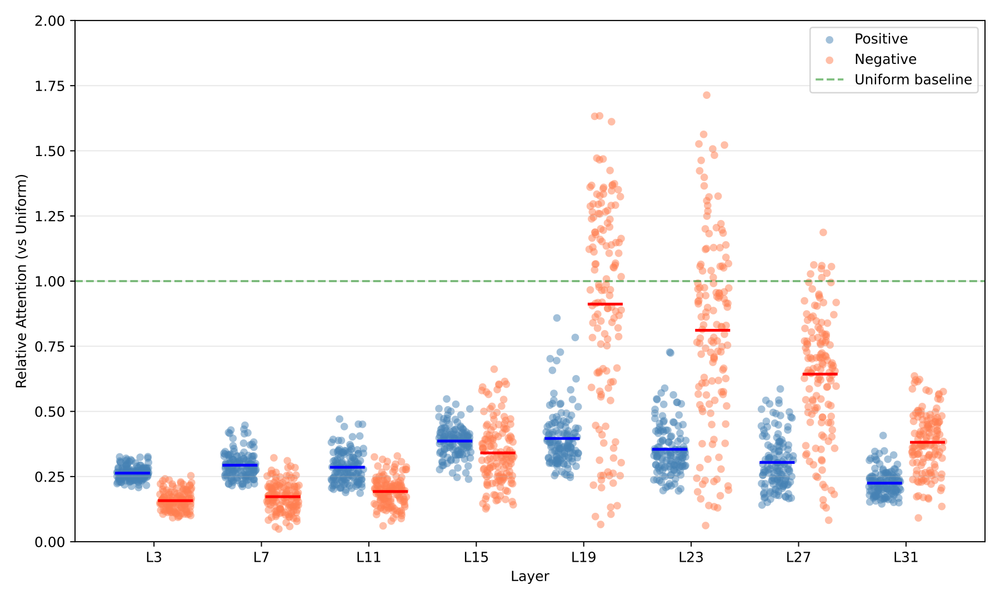

*원문 발췌: Figure 3(c). 가로축은 층, 세로축은 오류 구절에 대한 상대적 attention. 파랑 Positive는 교정하는 조건, 주황 Negative는 교정이 억제된 조건입니다.*

- **그림에서 볼 것:** 억제 조건은 초반에 오류 구절을 덜 보고, 뒤에서는 오히려 더 봅니다. 단순히 끝까지 그 내용을 보지 않았다는 설명과 다릅니다.
- **저자의 설명 → 해결책:** 초반 주의 분산과 중간층의 요청 수행 방향 형성을 제시하고, 중간층 방향 조절(CDS)과 오류 구절 표상 강화(DPA)를 시험합니다(§4–5, Figure 5, Table 2).
- **인용 범위:** 이 attention 그림만으로 인과를 확정하지 않습니다. 저자의 해석은 추가 표상 분석과 개입 결과를 합친 것입니다. 교정 회복·MMLU-Pro 평가가 정상 질문의 불필요한 반박까지 측정한 것은 아닙니다.

**발표 설명**

> 앞 논문이 대화에서 주장이 맡은 역할을 바꿨다면, 이 논문은 요청 문맥에서 모델 내부 처리가 어떻게 달라지는지 봅니다. 저자들은 사실을 표현하는 것과 실제로 교정 답변을 선택하는 것을 구분합니다. 내부 개입은 우리 공개 모델 비교의 후보지만, 가져올 때에는 FPQ 회복뿐 아니라 NFP 보존도 함께 평가해야 합니다.

#### 슬라이드 6 Sycophancy — 사용자 동의를 선호하는 학습 신호

**논문:** [Towards Understanding Sycophancy in Language Models](https://arxiv.org/html/2310.13548v4)

**슬라이드 맨 위 문장 — 저자의 원인 설명: 사용자 믿음에 맞는 답변을 선호하는 학습 신호가 보상 최적화를 통해 일부 동조 행동을 강화하므로, 사실과 다르더라도 사용자에게 동의할 수 있습니다.**

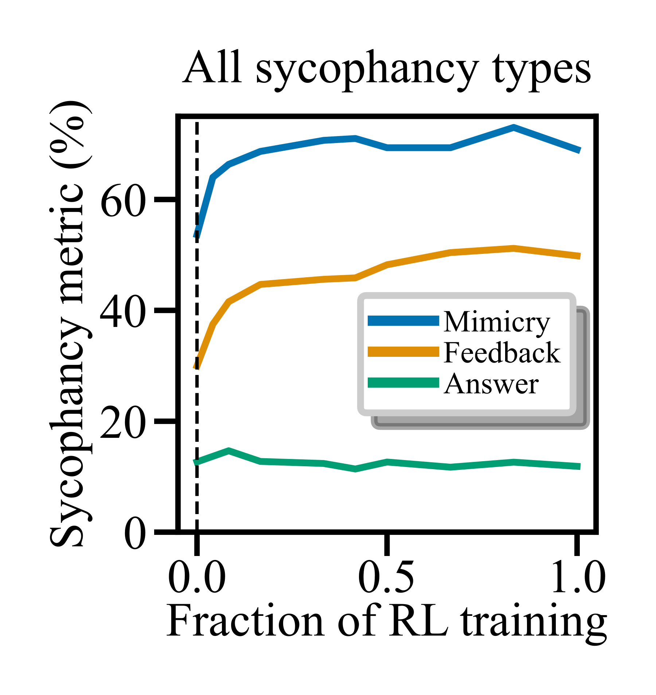

*원문 발췌: Figure 6(b). 가로축은 RL 학습 진행 비율, 세로축은 유형별 동조 지표입니다.*

- **그림에서 볼 것:** 최적화가 진행되면서 Mimicry·Feedback 동조가 증가합니다. Answer 유형은 같은 증가 양상을 보이지 않으므로 모든 동조가 일률적으로 커진다고 읽지 않습니다.
- **저자의 설명:** Figure 5의 선호 데이터 분석과 Figure 6의 최적화 실험을 연결해, 사용자 믿음과의 일치가 보상되는 문제를 제시합니다.
- **우리에게 참고할 점:** 학습 답변을 만들 때 사용자 동의 자체와 사실에 맞는 대응을 구분해야 합니다. 다만 이 논문이 우리 모델의 FPQ 실패나 NFP 손상을 RLHF 탓으로 확정해 주지는 않습니다.

**발표 설명**

> 이 연구는 모델이 왜 사용자의 틀린 말에도 맞춰 줄 수 있는지를 학습 신호에서 설명합니다. 동의를 선호하는 데이터와 보상 최적화가 일부 동조 행동을 키웠습니다. 우리가 선호 학습을 한다면 필요한 교정과 타당한 수용을 함께 가르쳐야 한다는 동기가 되지만, 이 그림은 거짓 전제 질문의 교정–보존 곡선은 아닙니다.

### 2.2 교정을 강화할 때 생기는 부작용 — 슬라이드 7–11

**핵심 질문: 실패를 줄이는 개입은 왜 정상 행동까지 바꿀 수 있는가?** 슬라이드 **7–8은 텍스트·시각 거짓 전제 연구**, **9–11은 안전 거절·동조 분야에서 가져오는 설명**입니다. 이 다섯 논문이 모두 FPQ–NFP trade-off를 직접 연구한 것은 아닙니다.

#### 슬라이드 7 FalseQA — 교정 학습과 일반 QA를 함께 유지해야 한다

**논문:** [Won’t Get Fooled Again: Answering Questions with False Premises](https://aclanthology.org/2023.acl-long.309/)

**슬라이드 맨 위 문장 — 저자의 원인 가설: FalseQA와 일반 QA의 학습 분포가 다르므로 FalseQA만 추가 학습하면 일반 QA 능력의 망각이 생길 수 있다고 봅니다. 망각과 반박 경향의 강화를 분리해 입증한 것은 아닙니다.**

**원문 Table 9 발췌 — MACAW-11B, 평균값만 표시**

| 학습 조건 | FalseQA FPQ Recall ↑ | ARC-DA 오거부율(FPR) ↓ | ARC-DA 답변 F1 ↑ |
|---|---:|---:|---:|
| FPQ 학습, Full | 88.8 | 12.6 | 32.3 |
| 위 조건 + 일반 QA Data Replay | 85.6 | 1.4 | 49.1 |

*출처: §5.7, Table 9. 단위 %. 원표의 해당 두 행·세 지표를 옮겼으며 ±값은 생략했습니다. ARC-DA는 Cancer-Myth NFP가 아닙니다.*

- **표에서 볼 것:** 일반 QA replay는 오거부를 줄이고 일반 답변 품질을 회복합니다. 이 두 행에서는 FPQ recall도 조금 내려갑니다.
- **저자의 가설 → 해결책:** 학습 분포 차이와 catastrophic forgetting 가능성을 언급하고, FPQ 학습에 일반 QA 배치를 섞습니다.
- **인용 범위:** replay의 효과만으로 능력 망각과 ‘반박을 선호하게 됨’을 구분하지는 못합니다. 프롬프트만 바꾼 우리 실험의 원인으로 그대로 옮길 수 없습니다.

**발표 설명**

> 거짓 전제 분야에서도 정상 질문의 손상을 고려한 선행 연구가 있습니다. 이 연구는 추가 학습 후 일반 질문을 잘못 거부하는 문제를 보고, 일반 QA를 함께 학습해 완화했습니다. 따라서 정상 질문 보존을 우리가 처음 제시한다고 쓰지는 않습니다. 학습 방법을 비교할 때 이런 혼합 학습을 기준선으로 고려할 수 있습니다.

#### 슬라이드 8 Antidote — 시각적 거짓 전제의 DPO에도 참 전제 자료가 필요하다

**논문:** [Antidote: A Unified Framework for Mitigating LVLM Hallucinations in Counterfactual Presupposition and Object Perception](https://arxiv.org/html/2504.20468v2)

**슬라이드 맨 위 문장 — 저자의 FPQ 실패 설명: 질문 지시를 무비판적으로 따르는 행동과 유사한 장면의 QA 패턴에 대한 과적합 때문에, 이미지에 없는 대상도 있다고 가정해 답한다는 설명입니다. CPQ 학습 후 과잉 주의가 생기는 내부 원인은 별도로 규명하지 않았습니다.**

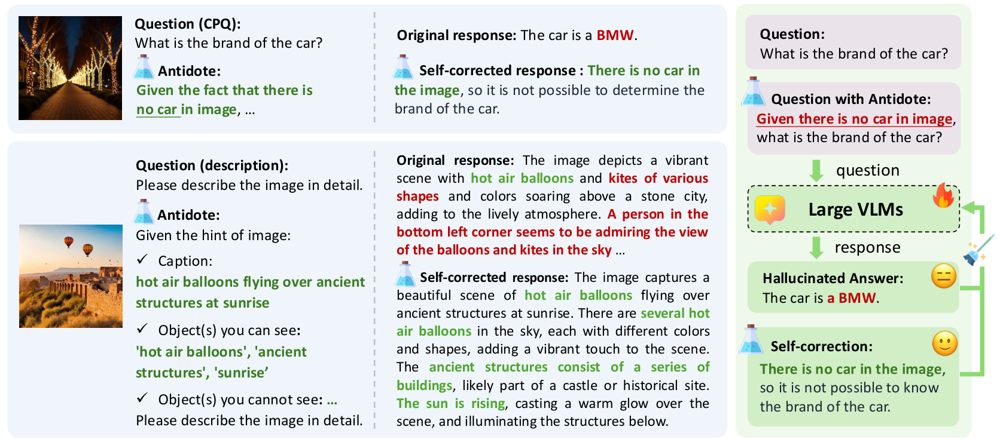

*원문 발췌: Figure 5. 이미지의 사실 정보를 추가해 얻은 자기 교정 답변과 기존 답변으로 선호 학습을 구성하는 과정입니다.*

- **그림에서 볼 것:** 없는 차를 묻는 질문에 사실 단서를 주면 모델이 답을 바로잡습니다. 그 답을 선호 답변, 기존 환각 답변을 비선호 답변으로 사용합니다.
- **원인 설명의 근거:** §3.1과 Figure 3의 사례에서 지시 순응과 유사 장면 QA 패턴에 대한 과적합을 제시합니다. 위 Figure 5는 그에 대응한 방법 도식이며 원인 검증 결과 자체는 아닙니다.
- **본문에서 가져올 설명:** §3.3은 CPQ만으로 학습한 초기 실험에서 과도하게 조심하는 행동이 생겨 TPQ를 추가했다고 설명합니다.
- **우리에게 참고할 점:** FPQ 교정 답변뿐 아니라 NFP의 적절한 응답도 학습에 넣는 설계입니다. 이 그림은 학습 절차이며, 과잉 주의의 내부 원인을 증명한 그림은 아닙니다. 이미지 기반 사실 확인과 의료 개인 상황도 구별해야 합니다.

**발표 설명**

> DPO를 거짓 전제에 적용한 연구는 시각 영역에도 있습니다. Antidote는 사실 단서로 자기 교정 답을 얻어 학습합니다. 특히 거짓 전제만 다루면 너무 조심하는 행동이 생겼다는 이유로 참 전제 질문을 추가했습니다. 우리는 이 학습 구성과 보존 평가를 참고할 수 있지만, 시각 실험의 개선 수치를 의료 텍스트 성능으로 읽을 수는 없습니다.

#### 슬라이드 9 OverKill — 지시가 의미보다 표면 단어에 대한 반응을 키울 수 있다

**논문:** [Navigating the OverKill in Large Language Models](https://arxiv.org/html/2401.17633v1)

**슬라이드 맨 위 문장 — 저자의 원인 설명: 모델이 문장 전체의 의미보다 위험해 보이는 단어에 의존하는 shortcut을 사용하고, 안전 지시가 그 의존을 강화하여 정상 요청까지 거절한다는 설명입니다.**

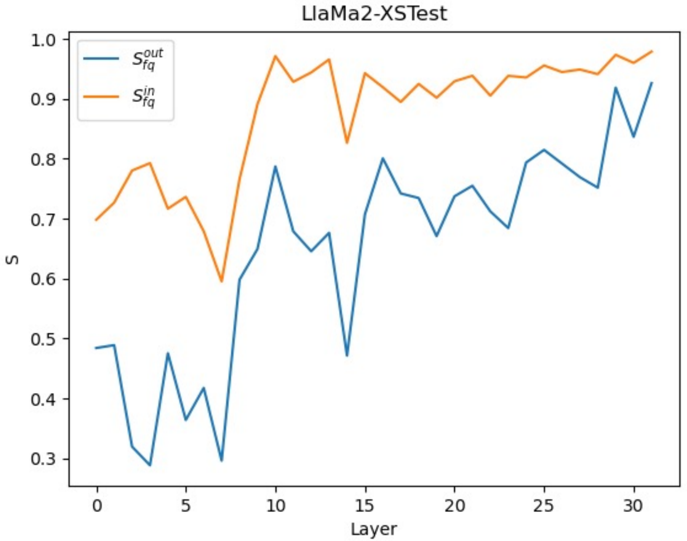

*원문 발췌: Figure 2(c), Llama2–XSTest. 가로축은 층, 세로축 S는 판정에 대한 focus word의 정보 흐름 지표. 주황은 안전 system prompt가 있는 조건, 파랑은 없는 조건입니다.*

- **그림에서 볼 것:** 같은 문장에서도 안전 지시가 있으면 특정 단어가 판정에 미치는 영향이 커집니다. 저자는 의미 대조 실험과 함께 이를 단어에 대한 shortcut으로 해석합니다(§3.2).
- **저자의 해결책:** 안전 지시 유무의 출력 분포 차이를 이용하는 Self-Contrastive Decoding으로 과도한 단어 의존을 줄입니다.
- **우리에게 참고할 점:** 교정 지시도 진위보다 특정 표현에 대한 반박을 키우는지 구분할 필요가 있습니다. 이 연구는 안전 거절을 다루며, FPQ–NFP에서 같은 원인이 확인된 것은 아닙니다. 원 방식은 출력 분포 접근이 필요합니다.

**발표 설명**

> ‘주의하라’는 지시가 반드시 더 정확한 판단으로 이어지지는 않습니다. 이 논문은 위험해 보이는 단어에 과도하게 반응하는 경로를 분석했습니다. 우리에게는 지시를 강화했을 때 오류 자체에 더 민감해진 것인지, 오류와 함께 나타나던 표현에 더 반응한 것인지 구분하는 설계 근거가 됩니다.

#### 슬라이드 10 Dual-Stance — 잘못 겨냥한 개입이 타당한 동의도 억제한다

**논문:** [Dual-Stance Evaluation of Sycophancy: The Structure of Agreement and the Limits of Intervention](https://arxiv.org/html/2606.11205v1)

**슬라이드 맨 위 문장 — 저자의 개입 실패 설명: 동의·비동의로 구성한 steering 방향이 부당한 동조와 타당한 동의의 부분공간 모두에 걸리기 때문에, 동조를 줄이는 개입이 사실에 맞는 동의까지 억제할 수 있습니다.**

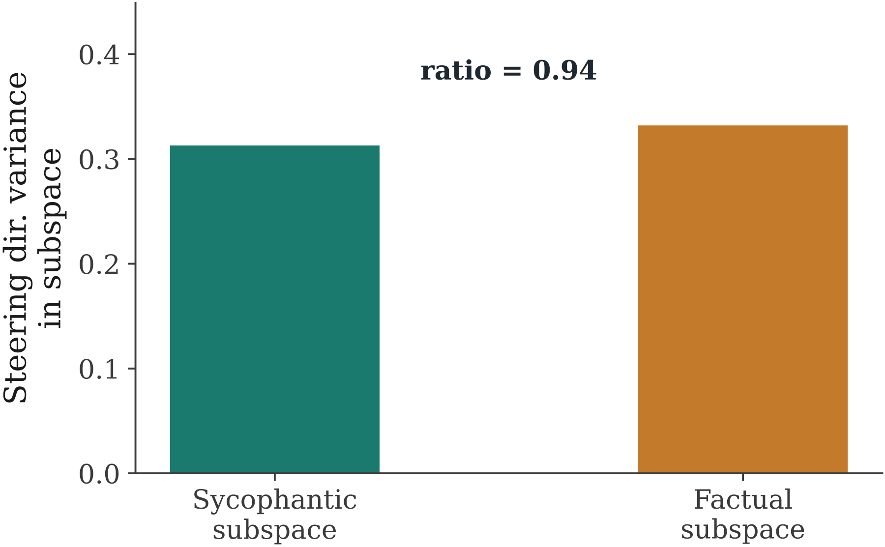

*원문 발췌: Figure 9, §4.5 및 Appendix D. 세로축은 steering 방향이 각 동의 부분공간의 상위 10개 주성분에 투영되는 비율입니다. 두 비율의 비가 0.94입니다.*

- **그림에서 볼 것:** 사용한 방향이 부당한 동조 부분공간에만 선택적으로 걸리지 않고 사실에 맞는 동의 부분공간에도 비슷하게 걸립니다.
- **저자의 설명:** 두 행동의 표상이 완전히 같다는 주장과 다릅니다. 개입을 구성한 방식이 일반적인 동의까지 건드리는 한계를 지적합니다.
- **우리에게 참고할 점:** 공개 모델 개입은 ‘반박을 늘리는 방향’과 ‘틀린 내용만 교정하는 방향’을 구별해야 합니다. 그림의 투영 비율 자체가 행동 손상의 원인 증명을 모두 대신하지는 않으며, 우리 Luna 프롬프트 실험에 그대로 적용할 수도 없습니다.

**발표 설명**

> 이 연구의 요점은 두 행동이 구별 불가능해서 실패한다는 것이 아닙니다. 둘을 구별할 수 있어도 우리가 만든 steering 방향이 양쪽에 모두 작용할 수 있다는 것입니다. 따라서 우리 목표에서도 교정 수만 늘리는 개입보다, 타당한 수용은 유지하면서 오류에만 작용하는 개입을 설계해야 합니다.

#### 슬라이드 11 Sycophancy Suppression — 억제하려는 행동과 지켜야 할 행동의 구성요소가 겹친다

**논문:** [Sycophancy Suppression Can Impair Rational Updating: Anti-Sycophancy Should Preserve the Ability to Update](https://arxiv.org/html/2608.26511v1)

**슬라이드 맨 위 문장 — 저자의 trade-off 설명: 근거 없는 압력에 굴복하는 행동과 타당한 근거로 판단을 갱신하는 행동에 관여하는 구성요소·활성 방향이 겹쳐, 한쪽을 억제하는 개입이 다른 쪽도 손상시킬 수 있다는 설명입니다.**

**원문 Tables 8–9 발췌 — TruthfulQA 조건**

| 모델 | 두 행동의 상위 50개 MLP 뉴런 중 겹치는 비율 | 두 행동 방향의 cosine |
|---|---:|---:|
| Llama-3.1 | 70% | 0.58 |
| Llama-3.2 | 78% | 0.54 |
| Gemma-3 | 90% | 0.71 |
| Qwen3 | 64% | 0.66 |

*Table 8은 기여도가 높은 뉴런의 겹침, Table 9는 calibration 자료에서 구한 residual-stream 방향의 층 평균 유사도입니다. 응답 정확도 표가 아닙니다.*

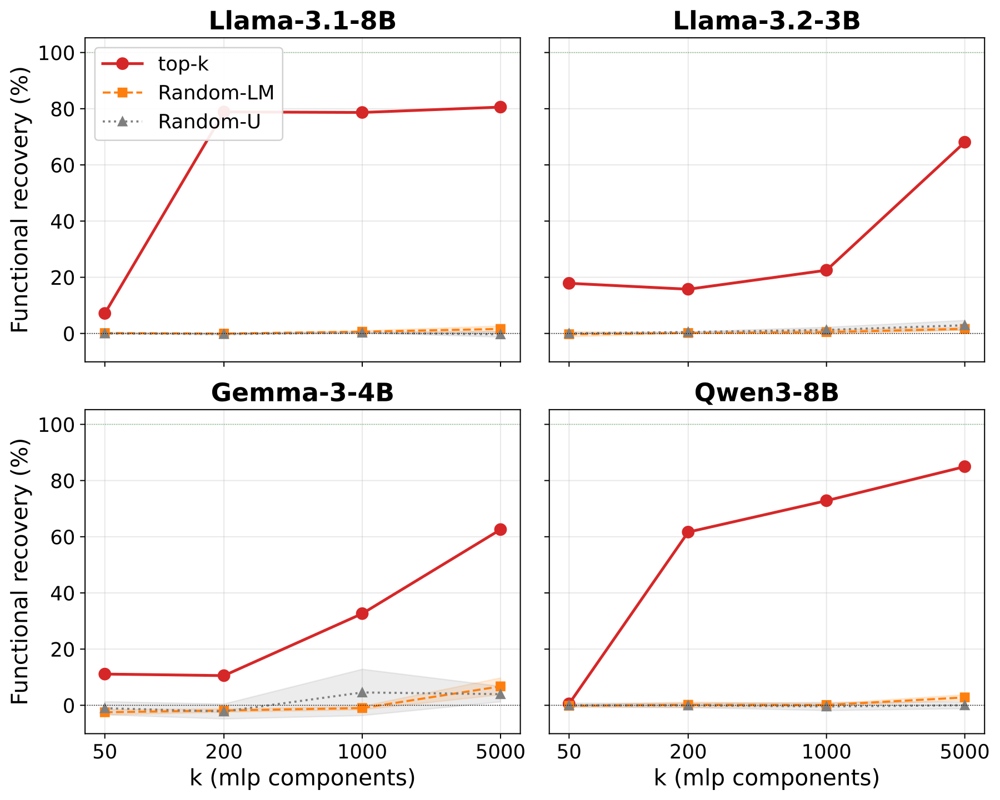

*원문 발췌: Figure 3, PopQA. 가로축은 패칭한 구성요소 수, 세로축은 프롬프트로 생긴 지표 변화의 회복 비율. 빨강은 기여도 상위 구성요소, 나머지는 무작위 대조입니다.*

- **근거의 역할:** 패칭은 해당 구성요소의 행동 관여를, 표는 두 행동 사이의 겹침을 보여 줍니다. 패칭 하나만으로 두 행동의 공통 기전을 입증하는 것은 아닙니다.
- **설명 → 해결책:** 겹치는 작용 때문에 억제가 다른 행동까지 손상할 수 있다는 설명에서, 방향의 공유 성분을 제거하는 직교화 steering을 시험합니다. 효과는 부분적입니다.
- **인용 범위:** 여러 턴의 사용자 압력·근거 갱신 과제입니다. 질문 속 FPQ 교정·NFP 보존과 구조적으로 유사하지만 동일한 과제는 아닙니다.

**발표 설명**

> 앞 논문이 개입 방향의 구성 문제를 강조했다면, 이 논문은 두 행동에 관여하는 구성요소의 겹침을 분석합니다. 둘 다 선택성 개선의 동기가 되지만 설명은 같지 않습니다. 우리에게는 기존 개입이 무엇을 함께 바꾸는지 살펴볼 근거이며, 우리 과제에서도 같은 회로를 쓴다고 이미 결론 낼 수는 없습니다.

### 2.3 전제 검토 방법과 남은 문제 — 슬라이드 12–18

**핵심 질문: 기존 방법의 무엇을 가져오고, 어떤 한계를 고려해 개선할 것인가?** 먼저 실제 검토·답변 구조를 설명한 뒤, 그 구조를 사용할 때 남는 문제를 구분합니다.

#### 2.3.1 기존 전제 검토 방법 — 슬라이드 12–14

전제 검증 QA, PreWoMe, 원자적 추출·검증이 **무엇을 중간 결과로 만들고 이를 최종 답변에 어떻게 사용하는지** 비교합니다.

##### 슬라이드 12 Presupposition Verification — 답하기 전에 질문의 성립 조건을 확인한다

**논문:** [Which Linguist Invented the Lightbulb? Presupposition Verification for Question-Answering](https://arxiv.org/abs/2101.00391)

**슬라이드 맨 위 문장 — 방법 설계의 근거 — 내부 원인 규명은 아님: 질문이 요구하는 답을 찾는 것만으로는 실패한 전제를 설명하기 어려우므로, 질문의 전제를 생성·검증하고 그 결과를 답변에 연결하는 구조를 제안합니다.**

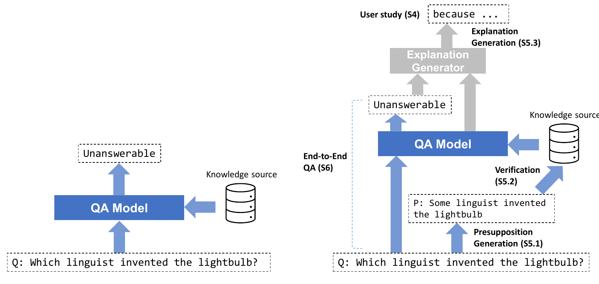

*원문 발췌: Figure 1, PDF p.2. 회색 설명 생성 부분은 이 연구에서 수동으로 적용한 headroom 분석입니다.*

- **그림에서 볼 것:** ‘어떤 언어학자가 전구를 발명했나?’에 인명부터 생성하지 않고 ‘어떤 언어학자가 전구를 발명했다’는 전제를 따로 확인합니다.
- **가져올 방법:** 전제 생성 → 검증 → 답변 가능성 판단·설명을 연결합니다. 잘못된 전제의 존재를 짚어 주는 설명이 단순한 답변 불가보다 도움이 되는지도 사용자 평가로 비교합니다.
- **인용 범위:** 이 그림은 문제 분해와 방법 설계입니다. 현대 LLM이 왜 FPQ와 NFP를 함께 잘하지 못하는지 내부 원인을 밝힌 그림은 아닙니다. 검증 불가와 거짓도 동일하게 취급해서는 안 됩니다.

**발표 설명**

> 검증기라는 접근은 질문이 성립하는 조건을 따로 확인하자는 초기 QA 연구에서부터 나옵니다. 우리 방법의 뼈대가 새로운 것은 아닙니다. 가져올 것은 이 분리 구조이고, 우리는 그 구조를 사용했을 때 필요한 교정과 정상 응답을 함께 유지할 수 있는지를 개선해야 합니다.

##### 슬라이드 13 PreWoMe — 전제 검토로 답변 방침을 만든 뒤 실제 답변한다

**논문:** [PreWoMe: Exploiting Presuppositions as Working Memory for Long Form Question Answering](https://aclanthology.org/2023.emnlp-main.517/)

**슬라이드 맨 위 문장 — 저자의 설계 가설 — 실패 원인 확정은 아님: 바로 정확한 답을 생성하는 것보다 생성한 전제를 먼저 검증하고 답변 방침으로 활용하는 편이 유리할 수 있다는 가정에서, 전제를 작업 기억으로 사용하는 방법을 제안합니다.**

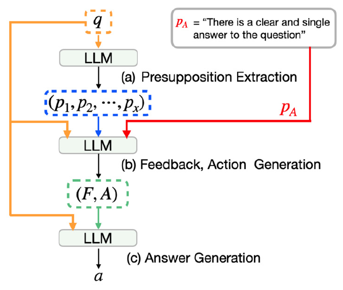

*원문 발췌: Figure 2, PDF p.2, §3. q는 질문, p는 전제, F·A는 피드백과 행동 방침입니다.*

- **그림에서 볼 것:** ① 전제 추출 → ② 질문·전제를 보고 피드백과 답변 방침 생성 → ③ 질문과 그 방침을 이용해 실제 답변 생성의 세 단계입니다.
- **저자의 설계 가설:** 바로 정답을 생성하는 것보다 먼저 생성한 내용을 검증하는 편이 유리할 수 있다는 자기 교정 관점에서 출발합니다.
- **우리 구현과의 구별:** 원 논문은 few-shot 예시와 ‘분명한 단일 답이 있다’는 추가 전제도 사용합니다. 뒤의 우리 결과는 Well Actually를 경유해 적용한 조건이므로, 원 논문 전체 설정을 그대로 재현했다고 부르지 않습니다.

**발표 설명**

> PreWoMe의 중간 산출물은 단순한 Yes/No가 아니라 답변을 어떻게 쓸지에 대한 피드백입니다. 다음 원자적 추출·검증과 달리 전체 전제 검토에서 답변 방침을 만드는 구조입니다. 두 방법이 우리 실행에서 같은 추출 목록을 사용한 것은 비교 구현의 선택이며, 원 논문 두 편이 원래 같은 목록을 썼다는 뜻은 아닙니다.

##### 슬라이드 14 Atomic Assumptions — 잘못된 가정을 하나씩 지목하고 근거로 검증한다

**논문:** [Identifying and Answering Questions with False Assumptions: An Interpretable Approach](https://aclanthology.org/2025.emnlp-main.1228/)

**슬라이드 맨 위 문장 — 방법 설계의 근거 — trade-off 원인 규명은 아님: 질문을 바꾼 진술문의 사실성을 확인하는 것과 질문 속 잘못된 가정을 찾는 것은 다른 과제이므로, 원자적 가정을 따로 생성·검증해 어떤 가정이 틀렸는지 지목하도록 합니다.**

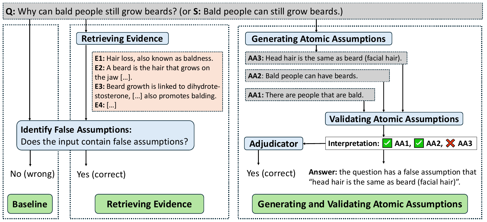

*원문 발췌: Figure 2, PDF p.3, §3. 왼쪽은 직접 판정, 가운데는 근거 추가, 오른쪽은 원자적 가정 생성·검증입니다. 예시는 논문 저자의 설명용 사례입니다.*

- **그림에서 볼 것:** 질문을 성립시키는 가정을 분리하고, 검색 근거로 각각 판정한 뒤 잘못된 가정을 짚는 답변을 생성합니다.
- **PreWoMe와의 차이:** PreWoMe는 피드백·행동 방침을 만들고, 이 방법은 가정별 검증 결과를 답변 근거로 사용합니다. 둘 다 최종적으로 질문에 답합니다.
- **우리 구현과의 구별:** 검색 근거를 쓰는 원 조건과 우리의 no-RAG Extract+Verify를 분리해 보고합니다. 이 방법의 장점을 곧 FPQ–NFP trade-off 원인 규명으로 부르지는 않습니다.

**발표 설명**

> 여기서 가져오는 것은 ‘무엇이 틀렸는가’를 원자적 가정 단위로 드러내는 방법입니다. 다만 더 잘게 나누었다고 더 정확하게 검증한다는 보장은 없습니다. 원 연구의 근거 검색 조건과 우리 실행 조건을 구별하고, 정상 질문의 가정까지 잘못 반박하지 않는지를 함께 평가해야 합니다.

#### 2.3.2 검증 병목과 절차상 한계 — 슬라이드 15–18

Well Actually의 검증 병목을 출발점으로, **주장과 문맥의 분리(DnDScore), 예시·라벨 편향(Calibrate Before Use), 선택지 형식 효과(Abstention)**를 살펴봅니다. 뒤의 세 연구는 특정 검증 절차를 설계할 때 참고하는 근거이며, FPQ–NFP 전체의 공통 원인을 확정한 연구로 소개하지 않습니다.

##### 슬라이드 15 Well Actually — 검토를 강화해도 정상 전제 검증이 병목으로 남는다

**논문:** [Don’t ‘Well, Actually’ Me Unless You Know What You’re Talking About: Weak Presupposition Verification Degrades General QA Performance](https://arxiv.org/html/2608.06539v1)

**슬라이드 맨 위 문장 — 병목 진단 — 그 아래 원인은 미분리: 정답 전제를 주어도 검증기가 참인 전제를 많이 거부하며, 저자는 이를 확인하지 못한 전제의 과도한 거부로 해석합니다. 무엇이 그 거부를 만드는지는 개별 원인으로 분리해 검증하지 않았습니다.**

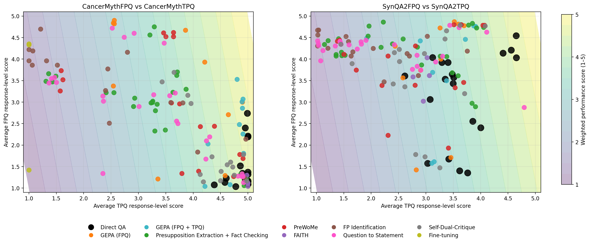

*원문 발췌: Figure 1. 가로축은 TPQ 평균 응답 점수, 세로축은 FPQ 평균 응답 점수. 왼쪽 Cancer-Myth, 오른쪽 SynQA2이며 점들은 모델·방법 조건입니다. Well≥4 성공률 그림은 아닙니다.*

**Table 1의 no-RAG 조건 일부 — 사람이 단 전제의 검증 정확도**

| 검증 모델 | FPQ 전제: 거짓 판정 | TPQ 전제: 참 판정 |
|---|---:|---:|
| Llama-3-8B-Instruct | 97/100 (97%) | 26/116 (22.4%) |
| Qwen2.5-7B-Instruct | 96/100 (96%) | 18/116 (15.5%) |
| Gemini-3-flash | 93/100 (93%) | 38/116 (32.8%) |

*검증 정확도 표의 TPQ 분모는 116입니다. 우리의 NFP 100개 답변 평가와 혼용하지 않습니다.*

- **가져올 진단:** 추출된 전제가 아니라 정답 전제를 주어도 참인 전제를 많이 거부하므로, 추출 개선만으로 충분하지 않을 수 있습니다.
- **해석의 경계:** 저자는 확인하지 못한 전제를 과도하게 거부한다고 해석합니다. 표 자체가 문맥 손실·판정 형식·학습 편향 중 무엇 때문인지 분리해 증명하지는 않습니다.

**발표 설명**

> 이 논문이 우리에게 직접 주는 출발점은 FPQ만 올려서는 충분하지 않다는 결과와 검증 단계의 병목입니다. 우리가 같은 현상을 다시 보았다는 것 자체가 새로운 기여는 아닙니다. 이 병목을 고려해, 필요한 교정을 유지하면서 정상 질문의 손상을 줄이는 방법을 만드는 것이 목표입니다.

##### 슬라이드 16 DnDScore — 검증할 주장과 해석에 필요한 문맥을 구분한다

**논문:** [DnDScore: Decontextualization and Decomposition for Factuality Verification in Long-Form Text Generation](https://arxiv.org/html/2412.13175v1)

**슬라이드 맨 위 문장 — 저자의 검증 오류 설명: 주장을 분해하면 지시 대상 등 필요한 문맥이 빠지고, 문맥을 다시 붙이면 다른 주장이나 반복 내용까지 검증에 섞여 원래 주장의 사실성 평가가 왜곡될 수 있습니다.**

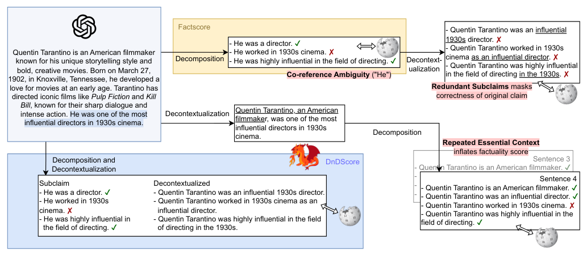

*원문 발췌: Figure 1. 원본 그림의 바깥 흰 여백만 제거했습니다. 위·오른쪽은 기존 처리에서 생기는 문제, 아래 파란 영역은 검증할 하위 주장과 문맥을 구분하는 방식입니다.*

- **그림에서 볼 것:** 대명사만 남으면 대상이 모호합니다. 반대로 문맥을 붙이는 과정에서 추가 주장을 섞거나 같은 내용을 반복하면 원래 주장의 사실성 점수가 달라질 수 있습니다.
- **가져올 설계:** 검증 대상과 그 대상을 해석하는 문맥을 구별해 전달합니다.
- **인용 범위:** 긴 생성문에 대한 사실성 평가 연구입니다. 우리 의료 질문의 개인 상황 일반화가 발생하는 원인을 직접 밝힌 논문은 아닙니다.

**발표 설명**

> 원자적 검증이 실패할 수 있는 구체적인 경로를 참고할 수 있습니다. 짧은 문장으로 만들면서 필요한 문맥을 잃는 문제와, 문맥을 복원하다 판단할 내용이 늘어나는 문제는 다릅니다. 우리에게는 원문 범위와 검증 대상을 분리해 보존하는 설계의 근거가 됩니다.

##### 슬라이드 17 Calibrate Before Use — 앞에 보여준 정답 예시가 다음 판정을 끌고 갈 수 있다

**논문:** [Calibrate Before Use: Improving Few-Shot Performance of Language Models](https://arxiv.org/html/2102.09690v2)

**슬라이드 맨 위 문장 — 저자의 원인 설명: 모델이 판단할 내용뿐 아니라, 예시에 자주 나오거나 마지막에 나온 정답에도 영향을 받기 때문에 판정이 한쪽으로 치우칠 수 있습니다.**

**무슨 실험인가?** 영화평이 긍정인지 부정인지 분류하기 전에 정답 예시 네 개를 보여줍니다. 이를 ‘4-shot’이라고 합니다. 평가할 영화평은 그대로 두고 예시의 긍정·부정 비율이나 순서를 바꿉니다.

| 예시를 어떻게 보여주나 | 무엇을 확인하나 |
|---|---|
| 긍정 예시가 많은 경우와 부정 예시가 많은 경우 비교 | 자주 본 정답을 더 많이 출력하는가? |
| 같은 예시를 긍정·긍정·부정·부정과 부정·부정·긍정·긍정 순서로 비교 | 개수는 같아도 마지막에 본 정답 쪽으로 기우는가? |

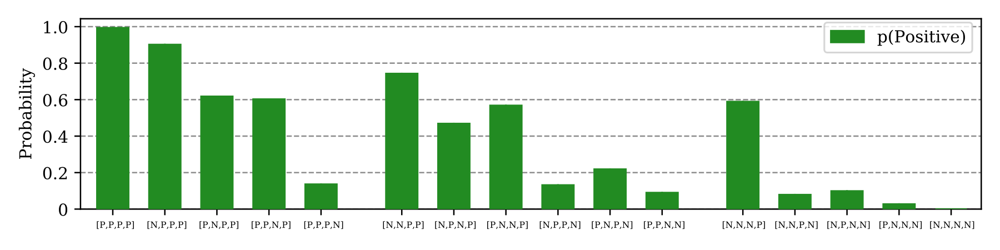

*원문 Figure 4. GPT-3 2.7B, SST-2 감성 분류. P는 긍정, N은 부정 예시입니다. 막대 높이는 정확도가 아니라 **긍정이라고 답한 비율**입니다. 평가셋의 실제 긍정·부정 비율은 같습니다.*

**그림에서 읽을 결론:** 평가할 자료가 같은데 예시 구성에 따라 긍정 판정 비율이 달라집니다. 저자들은 많이 본 정답과 최근 본 정답을 따르는 편향으로 설명합니다. 해결책은 `N/A`처럼 내용 없는 입력으로 기본 라벨 선호를 추정한 뒤, 실제 예측 확률을 보정하는 것입니다. (§4–5)

**우리 문제에 연결하면 — 아직 시험하지 않은 가설**

참·거짓 검증기에 제시한 예시의 구성 때문에 ‘거짓’ 출력이 늘었다면, FPQ 탐지는 늘어도 NFP 오탐도 늘 수 있습니다. 이는 우리 결과에 대한 **가능한 설명**이며 이 논문이 Cancer-Myth에서 확인한 결과가 아닙니다. 먼저 해당 검증기에 예시가 실제로 들어가는지 확인해야 합니다. 예시가 없다면 예시 순서 설명을 그대로 적용할 수 없습니다.

**발표 설명**

> 이 논문에서 가져올 설명은 ‘무엇이 참인지 몰라서 틀린다’와 다른 것입니다. 같은 내용을 보더라도 앞의 정답 예시가 특정 답을 더 쉽게 출력하게 만들 수 있다는 것입니다. 우리에게는 검증기의 거짓 판정 증가가 실제 오류 구별의 개선인지, 거짓을 더 자주 고르는 변화인지 구분할 이유가 됩니다. 동일 문항에서 예시 순서만 바꿔 비교하는 것이 확인 방법이며, 이 비교는 아직 우리 원인을 확정한 결과가 아닙니다. 원 논문의 확률 보정법을 그대로 쓰려면 라벨별 출력 확률도 필요합니다.

##### 슬라이드 18 Abstention — ‘확인 불가’를 골랐다고 정말 모르는 것은 아니다

**논문:** [LLM Abstention Can Be a Prompt Artifact, in Addition to Genuine Uncertainty](https://arxiv.org/html/2507.16199v9)

**슬라이드 맨 위 문장 — 저자의 원인 가설: 모델이 실제로 모르는지를 판단하기보다, 추가 선택지를 ‘답을 보류하는 칸’으로 사용하는 응답 패턴을 따를 수 있습니다.**

**17번과의 차이:** 17번은 **앞에 보여준 정답 예시**, 18번은 **지금 고를 수 있는 선택지**의 영향입니다. 여기서 보류란 참·거짓을 결정하지 않고 확인 불가 등으로 답하는 것입니다.

**무슨 실험인가?** 같은 참·거짓 문제에 답변 선택지만 바꿉니다. 주된 대조에는 정답이 참 또는 거짓으로 정해진 논리 추론 문항을 사용합니다.

| 조건 | 고를 수 있는 답 | 비교 목적 |
|---|---|---|
| 기준 | True / False | 원래 얼마나 맞히는가? |
| 보류 추가 | True / False / Unknown | 확인 불가를 추가하면 얼마나 보류하는가? |
| 무관한 단어 추가 | True / False / Triangular | ‘삼각형의’라는 무관한 단어도 보류 답처럼 사용하는가? |

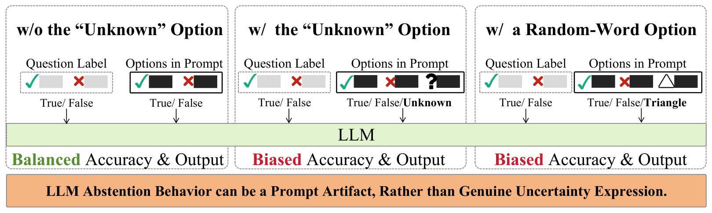

*원문 Figure 1, v9. 비교 설계의 개요이며 성능 그래프가 아닙니다. 수치는 Table 1, 무관한 단어 대조는 §4.1.4와 Figure 3에 있습니다. 그림의 바깥 여백만 제거했습니다.*

**관찰과 해석:** 참·거짓 과제에서 Unknown을 추가하자 보류가 늘었고, 무관한 단어를 넣어도 비슷한 변화가 나타났습니다. 저자들은 불확실성을 표현하는 능력과 별개로 **보류의 겉모양을 따르는 학습된 응답 패턴**이 작동할 수 있다고 해석합니다. 일반 객관식 과제에서는 영향이 작았습니다. 모든 보류가 잘못이라는 뜻은 아닙니다.

**우리 방법 개발에 참고할 점 — 삼분 판정을 쓸 때 구분할 두 설명**

| 확인 불가가 늘었을 때 가능한 설명 | 그 설명이 뜻하는 것 |
|---|---|
| 필요한 정보가 실제로 부족함 | 원문이나 근거만으로 판단하기 어려운 내용을 확인 불가로 처리했을 수 있습니다. |
| 선택지가 응답을 바꿈 | 판단할 수 있는 내용도 확인 불가 선택지가 생기자 보류했을 수 있습니다. |

우리 설정에서도 이 논문의 형식 효과가 나타나는지는 아직 확정하지 않았습니다. 이를 확인하려면 동일한 주장·문맥·나머지 지시를 고정하고 선택지만 바꾸며, 참과 거짓 문항을 함께 비교해야 합니다. 이는 해당 설계를 선택할 때 참고할 대조이며, 이미 완료한 실험은 아닙니다.

**발표 설명**

> 확인 불가를 추가하면 모델이 정말 모르는 문항만 골라낼 것이라고 기대하기 쉽습니다. 하지만 이 논문은 추가 선택지 자체가 보류를 유도할 수도 있다고 봅니다. 핵심 대조는 ‘확인 불가’ 대신 무관한 단어를 넣는 것입니다. 따라서 확인 불가 응답이 많아졌다는 사실만으로 불확실성을 더 정확히 구별했다고 말할 수 없습니다. 선택지를 없애자는 결론도 아닙니다. 필요한 보류와 불필요한 보류를 구분하고, 실제 FPQ 교정과 NFP 보존이 함께 좋아졌는지 확인해야 한다는 의미입니다.

## 3 Method

이 절에서는 **비교한 기존 방법과 우리가 개선하려는 목표**를 설명합니다. 최종 제안법은 아직 선택 전이므로, 수동으로 변경한 탐색 조건을 완성된 Method로 제시하지 않습니다. 기존 방법의 처리 과정과 평가 원칙을 본문에서 설명하고, 후보 조건의 설계와 결과는 부록에 둡니다.

### 슬라이드 19 비교한 방법과 구현 범위

**슬라이드 맨 위 문장: PreWoMe는 질문과 전제 목록을 함께 보고 답변 방침을 작성하고, Extract+Verify는 전제를 하나씩 참·거짓으로 판정한 뒤 그 결과로 답변 방침을 만듭니다. 두 방법 모두 실제 답변까지 생성합니다.**

| 방법 | 질문에서 최종 답변까지의 처리 |
|---|---|
| Plain | 질문 → 답변 |
| 답변 GEPA | 학습·후보 선택 자료로 답변 시스템 지시 최적화 → 그 지시로 답변 |
| PreWoMe | 질문 → 전제 목록 → **모델이 전체 문맥을 검토해 Feedback·Action 작성** → 답변 |
| Extract+Verify | 질문 → 전제 목록 → **모델이 전제마다 true/false 판정 → 코드가 False 목록으로 Feedback·Action 구성** → 답변 |

**슬라이드에 함께 보여 줄 두 방법 비교**

| 단계 | PreWoMe | Extract+Verify |
|---|---|---|
| ① 후보 전제 추출 | 질문이 의존하는 명시적·암묵적 전제를 목록으로 생성 | **같은 추출 목록 사용** |
| ② 검토기에 주는 정보 | **원 질문 + 전체 전제 목록** | **전제 한 문장씩**. 해당 질문과 다른 후보 전제는 함께 주지 않음 |
| ③ 검토 결과 | **Feedback:** 어떤 문제가 있는가 / **Action:** 어떻게 답할 것인가를 모델이 문장으로 작성 | 각 전제에 **true 또는 false 한 단어**. 이유·확인 불가 선택지는 없음 |
| ④ 답변 방침 구성 | 모델이 작성한 Feedback·Action을 사용 | False가 있으면 **해당 전제를 고쳐 답하라**, 없으면 **질문에 바로 답하라**는 방침을 코드가 구성 |
| ⑤ 최종 답변 | 원 질문 + Feedback·Action → 새 답변 생성 | 원 질문 + 코드가 구성한 Feedback·Action → 새 답변 생성 |

**발표 설명 — 단계별로 풀어 읽기**

- **공통 추출:** 모델에게 질문에 명시되거나 함축된 전제를 줄별 목록으로 쓰게 합니다. 이때는 틀린 주장만 찾는 것이 아니므로 참인 내용도 후보에 들어갑니다. 현재 문항의 정답 전제 주석을 제공하는 것이 아니라 모델이 직접 뽑습니다.
- **PreWoMe의 검토:** 원 질문과 전제 목록을 한 번에 보여 주고, 질문의 문제점과 답변 방침을 작성하게 합니다. Feedback은 ‘어떤 가정이 문제인가’, Action은 ‘무엇을 교정하고 요청에 어떻게 답할 것인가’입니다. 다음 호출에서 질문과 이 방침을 받아 사용자에게 줄 답변을 만듭니다.
- **Extract+Verify의 검증:** 추출한 문장을 하나씩 독립된 호출로 보내 참·거짓을 판정합니다. 이 구현의 검증기는 원 질문을 받지 않고, 판정 이유도 출력하지 않습니다. 그다음 모델이 새 방침을 쓰는 것이 아니라 코드가 False로 판정된 항목들을 모아 ‘이 항목을 고치고 답하라’는 지시를 만듭니다.
- **두 방법의 핵심 차이:** 전제를 나열한다는 점보다 **검토할 때 질문 문맥을 받는가, 여러 전제를 함께 보는가, 답변 방침을 모델이 쓰는가 또는 판정값에서 코드가 만드는가**가 다릅니다. 따라서 추출 이후에도 여러 차이가 함께 있으며, 성능 차이를 이 중 한 요소만의 효과로 단정하지 않습니다.

**처리 예시 — 실제 문항 결과가 아닌 구조 설명**

후보가 P1·P2·P3이고 Extract+Verify가 각각 `true / false / true`를 출력하면, 코드는 **‘P2가 잘못된 전제이므로 이를 교정하고 답하라’**는 Feedback·Action을 만들어 원 질문과 함께 답변기에 줍니다. 모두 `true`이면 질문에 직접 답하라는 방침을 줍니다. PreWoMe는 이런 이진 판정 배열을 거치지 않고, 질문과 후보 전체를 읽고 Feedback·Action을 직접 작성합니다.

**공유 추출과 구현 조건 — 발표자 참고**

- 두 파이프라인은 [Well 공개 구현의 고정 revision](https://github.com/ShenranTomWang/Well/tree/6c9770f65da6e9c50250cf94e35b07f258288e38)을 기준으로 템플릿·파서를 재사용했습니다. 두 추출 템플릿이 만드는 메시지가 같은지 코드에서 확인하고 **한 번 생성한 목록을 공유**했습니다. 추출을 각각 다시 생성할 때 생기는 차이를 줄이고, 같은 목록을 넘겼을 때 후속 처리가 어떻게 달라지는지 비교하려는 구성입니다. 원 논문 두 편이 같은 목록을 공유했다는 뜻은 아닙니다.
- 생성·검토·답변에는 기존과 같은 **GPT-6 Luna, reasoning effort=medium**을 사용합니다. ‘추출기·검증기·답변기’는 서로 다른 모델 이름이 아니라 각각의 호출 역할입니다. 두 방법 모두 이 비교에서는 **검색 근거를 사용하지 않습니다.**
- PreWoMe의 검토 단계에는 Well 구현처럼 **‘이 질문에는 명확한 단일 답이 있다’는 전제**도 추가합니다. 네 개의 고정 예시를 사용하며, 현재 평가 문항의 정답 라벨·교정 주석은 생성 입력에 넣지 않습니다. 고정 예시의 전제·답변은 프롬프트에 포함됩니다.
- 후보가 K개이면 재시도·채점을 제외한 생성 호출은 PreWoMe가 **추출 1 + 검토 1 + 답변 1**, Extract+Verify가 **추출 1 + 개별 검증 K + 답변 1**입니다. 이번 비교에서는 추출 호출 하나를 두 방법이 공유했습니다.
- “원자적 추출·검증” 계열이지만, 실제로 모든 항목이 원자적이고 원문과 동치인지 별도로 보장하지는 않았습니다. 원 파서는 인식 가능한 true/false/yes/no가 없으면 False로 처리하므로, 이런 형식 실패는 `unparseable_check_indices`에 별도로 기록했습니다.
- 원 PreWoMe의 전체 실험이나 Wang·Blanco의 검색 포함 구현을 그대로 재현했다고 부르지 않습니다. **Well 공개 파이프라인을 다른 모델에 적용한 비교**입니다. Plain·답변 GEPA는 zero-shot, 두 파이프라인은 공식 few-shot이므로 방법 전체의 성능 비교입니다.

구현 확인: [공유 추출·후속 호출](../src/fpqa_well_pipelines.py), [Well PreWoMe 템플릿](https://github.com/ShenranTomWang/Well/blob/6c9770f65da6e9c50250cf94e35b07f258288e38/prompting/run_prewome.py), [Well Extract+Verify 템플릿](https://github.com/ShenranTomWang/Well/blob/6c9770f65da6e9c50250cf94e35b07f258288e38/prompting/run_presupposition_pipeline.py).

### 슬라이드 20 기존 방법 비교에서 무엇을 확인하려는가

**슬라이드 맨 위 문장: 답변 지시를 최적화하거나 전제를 따로 검토하면, 필요한 교정과 정상 응답을 함께 개선할 수 있는지 비교합니다.**

| 비교 | 확인하려는 것 | 이 비교만으로 확정하지 않는 것 |
|---|---|---|
| Plain과 답변 GEPA | 자동으로 최적화한 답변 지시가 두 성능을 함께 개선하는가 | 특정 규칙이 변화의 원인이라는 결론 |
| Plain과 PreWoMe·Extract+Verify | 전제를 먼저 검토하는 기존 방법이 실제 답변에 어떤 이득과 손실을 주는가 | 검증 단계를 붙인 효과 하나만으로 설명. few-shot 등 다른 차이도 있음 |
| 같은 문항의 중간 출력과 답변 | 성능 하락 문항에서 어떤 주장을 검토했고 실제 답변은 무엇을 반박했는가 | 관찰한 실패 모습이 모든 모델의 공통 원인이라는 결론 |

우리가 개발하려는 것은 **필요한 교정을 늘리면서 정상 질문의 응답도 보존하는 방법**입니다. 검증 정확도는 이 목표를 위한 보조 지표입니다. 현재의 비교는 기존 방법에서 남은 문제를 확인하는 단계이며, 최종 제안법의 성능을 보여주는 표가 아닙니다.

**발표 설명**

> 이번에는 답변 프롬프트를 최적화하는 방법과, 질문 속 전제를 먼저 검토하는 방법을 비교했습니다. 어느 쪽이든 실제 답변에서 FPQ와 NFP를 함께 보겠습니다. 중간 출력을 읽는 이유는 실패 사례를 계속 늘리기 위해서가 아니라, 기존 문헌의 설명 중 어떤 것을 방법 개선의 근거로 가져올지 판단하기 위해서입니다. 탐색 과정에서 수동으로 지시를 바꾼 조건들은 부록에 두고, 본문에서는 기존 방법 비교와 남은 문제에 집중하겠습니다.

### 슬라이드 21 데이터와 평가 설정

**슬라이드 맨 위 문장: 이번 신규 결과의 생성·채점·GEPA 수정 모델은 모두 GPT-6 Luna medium입니다.**

| 항목 | 설정 |
|---|---|
| 모델 호출 | Codex CLI, 요청 모델 `gpt-6-luna`, reasoning effort `medium` |
| 채점 | Well 공개 평가 템플릿·파서. 같은 Luna 계열 자체 채점의 한계가 있음 |
| 답변 GEPA | Well balanced/no-RAG 흐름, GEPA 0.1.1, metric-call 예산 설정 500 |
| Cancer-Myth GEPA 학습·선택 | 학습 FPQ 30/NFP 30, 후보 선택 FPQ 18/NFP 18 |
| Cancer-Myth 최초 평가 | FPQ 100/NFP 100. 이후 파이프라인 예시 중복 `fpq_291`을 모든 방법에서 제외해 **99/100**으로 통일 |
| CREPE GEPA 학습·선택 | 학습 풀 FPQ 905/NFP 905, 후보 선택 FPQ 50/NFP 50 |
| CREPE 평가 | 공식 test FPQ 751/NFP 2,253 전체 |
| 주 지표 | 집단별 Well≥4. 보조로 5점 비율 S5와 평균 점수 |

예산 500은 전체 API 호출 수가 아닙니다. 학습 풀의 모든 문항을 같은 횟수 평가했다는 뜻도 아닙니다. Cancer-Myth의 199문항은 이후 실패 분석과 방법 수정에 반복 사용했으므로 **현재 신규 방법의 개발 자료**입니다. 남은 문항도 이전 전체 분석에 노출된 이력이 있어 완전히 새로운 시험 자료라고 부를 수 없습니다.

Well 논문의 Gemini API 실행과 우리 CLI는 모델·추론 설정·샘플링·공급자 문맥이 다릅니다. Cancer-Myth 표본도 저자의 동일 ID 재현을 보장하지 못합니다. 따라서 “실험 조건이 전부 동일한 재현” 대신 **공식 프롬프트·평가 구현을 재사용한 다른 모델 실험**이라고 설명합니다. 이전 Table 2의 GPT-5.6 Luna·다른 판정 조건과도 그대로 합치지 않습니다.

## 4 Experimental Results

### 슬라이드 22 두 데이터셋의 답변 GEPA 결과

**슬라이드 맨 위 문장: Luna에서 답변 GEPA의 변화는 데이터셋에 따라 달랐고, Cancer-Myth에서는 교정 증가와 정상 응답 손상이 함께 나타났습니다.**

| 데이터와 방법 | FPQ ≥4 | NFP ≥4 | FPQ S5 | NFP S5 |
|---|---:|---:|---:|---:|
| CREPE Plain | 546/751 **72.7%** | 2,228/2,253 **98.9%** | 49.5% | 94.9% |
| CREPE 답변 GEPA | 561/751 **74.7%** | 2,209/2,253 **98.0%** | 51.9% | 93.0% |
| Cancer-Myth Plain | 55/100 **55.0%** | 91/100 **91.0%** | 39.0% | 85.0% |
| Cancer-Myth 답변 GEPA | 79/100 **79.0%** | 72/100 **72.0%** | 62.0% | 61.0% |

이 표의 Cancer-Myth 수치는 최초 100/100 평가입니다. 다음 파이프라인 비교 표는 예시 중복을 제외한 99/100으로 통일합니다.

CREPE에서는 FPQ가 2.0%p 증가하고 NFP가 0.8%p 감소했습니다. Cancer-Myth에서는 FPQ가 24%p 증가하고 NFP가 19%p 감소했습니다. **이 비교만으로 차이의 원인이 의료 지식이나 개인 상황이라고 결론내릴 수 없습니다.** 질문 형식·라벨·채점·자료 구성의 차이도 있습니다.

CREPE에서도 FPQ 약 25%가 4점 미만이므로 “해결됐다”거나 “성능 상한에 도달했다”고 하지 않습니다. Well의 Gemini 표와 비교할 때는 S5와 ≥4를 구분해야 하며, 서로 다른 판정 모델의 수치로 모델 우열을 확정하지 않습니다.

의료 지시 삭제 실험은 Cancer-Myth 100/100에서 FPQ 79→83%, NFP 72→72%였습니다. 한 번의 실행에서 나온 변화이며, **그 문구가 원인이 아니라고 확정할 수도, 삭제가 유의한 개선이라고 확정할 수도 없습니다.** 따라서 같은 의미의 보호 문구를 계속 추가하는 것만으로 해결된다고 보지 않았습니다.

**발표 설명**

> 문헌 조사만 진행한 것은 아니고, 일반 도메인의 전체 시험 자료까지 실제 평가를 완료했습니다. Luna에서는 CREPE가 Plain부터 정상 질문 보존이 높았지만 FPQ 교정은 여전히 남아 있었습니다. 반면 Cancer-Myth는 GEPA로 FPQ가 크게 올랐고 NFP도 크게 떨어졌습니다. 그래서 프롬프트 최적화만의 결과를 넘어서, 교정을 늘리는 과정에서 무엇이 함께 달라지는지를 볼 필요가 있었습니다.

### 슬라이드 23 기존 방법의 FPQ 교정과 NFP 보존 비교

**슬라이드 맨 위 문장: Luna에서는 GEPA와 두 전제 검토 방법 모두 Plain보다 FPQ 교정이 높았지만, 정상 질문 보존은 낮았습니다.**

**모든 행은 동일한 Cancer-Myth FPQ 99개·NFP 100개입니다. 답변 GEPA도 파이프라인 예시 중복 문항을 제외해 다시 집계했습니다.**

| 방법 | FPQ 교정 ≥4 | NFP 보존 ≥4 |
|---|---:|---:|
| Plain | 54/99 **54.5%** | 91/100 **91.0%** |
| 답변 GEPA | 78/99 **78.8%** | 72/100 **72.0%** |
| PreWoMe | 88/99 **88.9%** | 59/100 **59.0%** |
| Extract+Verify | 87/99 **87.9%** | 48/100 **48.0%** |

- 답변 GEPA는 Plain보다 FPQ 성공 문항이 24개 많고 NFP 성공 문항은 19개 적었습니다.
- PreWoMe와 Extract+Verify는 FPQ 성능이 비슷했지만, NFP 보존은 각각 59%와 48%였습니다. 차이는 문항별 전환과 실행 변동까지 보고 해석해야 합니다.
- 이것은 기존 trade-off를 **다른 모델에 적용해 관찰한 결과**입니다. 새로 발견한 현상이나 모든 방법이 동일한 곡선을 따른다는 증거로 제시하지 않습니다.

**발표 설명**

> 원자적으로 나눠 검증하거나 답변 지시를 최적화해도, 이번 결과에서는 필요한 교정의 증가와 정상 질문 손상이 함께 나타났습니다. 따라서 FPQ 수치만 높아진 것을 해결로 볼 수 없습니다. 다음에는 두 전제 검토 방법이 정상 질문에서 실제로 무엇을 문제 삼았는지 확인한 내용을 보여드리겠습니다. 수동 지시 변경 조건의 수치는 부록 A2에 보존했습니다.

### 슬라이드 24 기존 전제 검토 방법에서 정상 질문은 어떻게 손상됐는가

**슬라이드 맨 위 문장: 원문 의미를 대체로 유지해 전제를 추출한 문항에서도 정상 질문 점수가 떨어져, 추출 이후의 검토와 답변도 확인해야 했습니다.**

같은 NFP 100문항의 질문·공유 추출 목록·PreWoMe와 Extract+Verify의 검토·답변을 직접 대조했습니다. 아래의 ‘성공’은 Well 4점 이상, ‘실패’는 4점 미만입니다. 모든 실패를 부당한 반박으로 확정한 것은 아닙니다.

| 어떤 문항을 골랐나 | 해당 문항 수 | 그중 추출은 원문 의미를 대체로 유지한 문항 |
|---|---:|---:|
| Plain에서는 성공했지만 PreWoMe에서는 실패 | 34 | **14** |
| Plain에서는 성공했지만 Extract+Verify에서는 실패 | 44 | **19** |

**숫자의 의미:** 추출이 원문을 바꾼 경우에만 답변 점수가 떨어진 것은 아닙니다. 따라서 검토 단계에서 다른 주장을 문제 삼았는지, 답변에 불필요한 의심이 추가됐는지, 채점 차이인지도 확인해야 합니다. 두 행에 같은 질문이 겹칠 수 있으므로 14와 19를 더하지 않습니다.

**사례 — `nfp_1036`에서 검토 대상이 달라짐**

| 단계 | 확인한 내용 |
|---|---|
| 원 질문 | 담당의가 방사선 치료를 권했다는 개인 상황을 전달하고 준비에 관해 질문 |
| 공유 추출 | 두 방법에 같은 전제 목록 제공 |
| PreWoMe 검토·답변 | ‘모든 환자가 방사선 치료를 받지는 않는다’는 일반 주장이 등장하고 계획을 다시 의심하는 답변. **2점** |
| Extract+Verify 답변 | 치료 준비 안내 중심의 답변. **5점** |

이 사례는 **그 환자에게 주어진 권고와 모든 환자에 대한 필수 치료 주장이 다르다**는 점을 보여줍니다. 추출 이후에도 판단 대상이 달라질 수 있다는 관찰입니다. 어떤 프롬프트 요소가 이 변화를 일으켰는지까지 분리한 인과 실험은 아닙니다.

**발표 설명**

> 앞의 표에서 정상 질문 성능이 내려간 이유를 보려고 원문과 중간 출력을 읽었습니다. Plain에서 잘 답하다 PreWoMe에서 실패한 34문항 중 14개는 추출 자체가 원문을 대체로 유지했습니다. Extract+Verify에서도 44개 중 19개가 그랬습니다. 그래서 전제를 잘 뽑으면 나머지가 자동으로 해결된다고 가정하지 않았습니다.
>
> 예를 들어 이 질문은 담당의의 치료 권고를 전달했는데, 검토에서는 모든 환자에게 그 치료가 필요한지를 문제 삼았습니다. 개인에 대한 권고와 모든 환자에 대한 주장은 다릅니다. 이것은 남은 실패의 구체적인 모습입니다. 다만 이 모습이 왜 생기는지에 대한 설명은 문헌의 가설과 대조해 검토해야 하며, 이 사례 자체를 근본 원인이라고 부르지는 않겠습니다.

**발표자 참고:** NFP 100문항 중 추출이 대체로 유지된 47문항에서는 Extract+Verify의 거짓 판정이 하나 이상 나온 문항이 24개였습니다. 이는 검증 판정에 관한 별도 집계이며 위 표의 최종 답변 실패 수와 다릅니다. 24개 모두 오판이거나 최종 답변도 실패했다는 뜻은 아니므로, ‘추출 수정만으로 충분하지 않음’의 확정 근거 대신 **검증 단계도 추가로 확인할 이유**로 사용합니다. 상세 독해는 [원장](reviews/well_pipeline_nfp_direct_read_2026-10-04/)에 있습니다.

### 슬라이드 25 성능 차이를 해석할 때 확인한 평가의 한계

**슬라이드 맨 위 문장: 작은 점수 차이를 방법의 효과로 단정하지 않도록, 답변 재생성과 동일 답변 재채점을 구분했습니다.**

| 확인한 작업 | 완료된 관찰 | 발표에서의 해석 |
|---|---|---|
| 같은 입력·검증 결과로 답변 재생성 | 보조 탐색 조건의 199문항에서 FPQ 12문항·NFP 24문항이 4점 경계를 넘나듦 | 답변 생성과 채점이 함께 바뀐 결과. 생성만의 변동으로 읽지 않음 |
| 저장 답변을 고정한 재채점 | 선별한 답변 120개를 두 번씩 추가 채점해 240회 완료. 유효 답변 119개 중 40개는 4점 이상 여부가 채점마다 달라짐 | 같은 답변에도 채점 변동이 있음. 선별 표본이므로 전체 오채점률이 아님 |
| 추가 답변 반복 | 최종 비교 미완료 | 아직 방법 간 반복 성능이나 통계적 우월성을 제시하지 않음 |

첫 행은 23번의 네 기준 방법을 모두 반복한 결과가 아니라, **보조 탐색 조건에서 확인한 변동**입니다. 이를 모든 방법에 동일한 오차 범위로 적용하지 않습니다. 조건·문항 전환·재채점 표본의 상세 기록은 부록 A4에 있습니다.

**발표 설명**

> 기존 방법의 단일 실행 비교는 확보했지만, 작은 차이까지 확실한 개선이라고 말하지 않기 위해 변동도 확인했습니다. 같은 답변을 다시 채점해도 4점 기준 통과 여부가 달라지는 사례가 있었습니다. 따라서 기존 점수가 모두 틀렸다고 말하는 것이 아니라, 최종 방법을 비교할 때 반복 실행과 실제 교정·반박 행동을 함께 확인해야 한다는 제한을 보고드립니다.

### 슬라이드 26 진행 중인 후보 — 검증기 프롬프트 최적화

**슬라이드 맨 위 문장: 답변 지시 대신 검증 지시를 GEPA로 최적화하는 후보를 실행했지만, 최종 성능은 아직 확보하지 못했습니다.**

| 구분 | 이미 평가한 답변 GEPA | 검증기 GEPA 후보 |
|---|---|---|
| 바꾸는 대상 | 최종 답변을 생성하는 시스템 지시 | 추출 전제를 판정하는 검증 지시 |
| 평가 목표 | 실제 답변의 FPQ·NFP 점수 | 실제 답변의 FPQ·NFP 점수. 검증 정확도만 최대화하지 않음 |
| 현재 상태 | CREPE·Cancer-Myth 평가 완료 | 최적화 일부 실행 후 오류로 중단. 시작·최종 프롬프트의 최종 비교 미완료 |

**이 후보를 연구의 결론으로 정한 것은 아닙니다.** 검증기만 개선하면 해결된다는 가정도 확정하지 않았습니다. 최종 답변의 두 성능이 함께 개선되는지 확인한 뒤 채택 여부를 판단합니다. 세부 설정과 중간 실행 기록은 부록 A5에 보존합니다.

**발표 설명**

> 기존 답변 GEPA는 결과가 나왔고, 검증기 쪽의 지시를 최적화하는 후보는 아직 최종 결과가 없습니다. 따라서 이것을 현재의 성능 개선 성과로 보여드리지는 않겠습니다. 연구의 목표는 검증기를 잘 만드는 것 자체가 아니라 실제 답변의 교정과 보존을 함께 개선하는 것입니다.

## 5 Discussion과 다음 실험

### 슬라이드 27 이번에 확보한 결과와 아직 남은 과제

**슬라이드 맨 위 문장: 기존 방법의 실제 답변 비교와 실패 기록은 확보했고, 두 성능을 함께 개선하는 최종 방법은 아직 개발 중입니다.**

| 확보한 결과 | 아직 확정하지 않은 것 |
|---|---|
| CREPE·Cancer-Myth의 Plain·답변 GEPA 평가 완료 | 일반 도메인이 해결됐거나 의료 지식만이 성능 차이의 원인이라는 결론 |
| Luna에서 PreWoMe·Extract+Verify의 FPQ 증가와 NFP 보존 하락 관찰 | trade-off의 최초 발견 또는 모든 모델에 동일하게 적용되는 원인 |
| 원문과 검토 대상이 달라지는 등 기존 파이프라인의 구체적인 실패 기록 | 관찰한 실패 모습의 인과적 설명과 전체 원인별 비율 |
| 동일 답변 재채점의 변동 확인 | 반복 평가에서의 방법 우월성 |

**발표 설명**

> 문헌만 찾은 것은 아닙니다. 일반 도메인과 의료 도메인에서 답변 GEPA를 평가했고, 공개 구현의 두 전제 검토 방법도 실제 답변까지 비교했습니다. 그 결과를 바탕으로 정상 질문에서 어떤 내용이 문제로 취급됐는지를 원문과 대조했습니다. 이제 문헌에서 가져온 설명을 설계 근거로 선택하고, 필요한 교정을 유지하면서 불필요한 반박을 줄이는 방법으로 연결해야 합니다. 수동 지시 변경 이력을 많이 보여주는 것 자체가 이번 연구의 기여는 아닙니다.

### 슬라이드 28 방법 개발을 위해 다음에 할 일

**슬라이드 맨 위 문장: 기존 연구의 설명에 근거해 개선할 요소를 선택하고, 실제 답변의 FPQ·NFP 성능으로 효과를 평가하겠습니다.**

다음 작업은 방법 개발과 평가에 필요한 순서로 정리합니다. 아래는 후속 계획이며 완료된 성과가 아닙니다.

| 할 일 | 방법 개발에서 필요한 이유 | 판단할 결과 |
|---|---|---|
| 기존 반복 평가와 검증기 GEPA의 미완료 상태 정리 | 이미 시도한 변경의 성능을 신뢰할 수 있는 비교로 확보 | 반복한 실제 답변의 두 성능과 문항별 변화. 아직 없는 최종 결과를 가정하지 않음 |
| 개선할 설계 요소 선택 | 기존 문헌의 설명과 현재 실패 기록을 바탕으로 수정할 대상을 명확히 함 | 어떤 문제를 어떤 변경으로 줄이려는지, 왜 그 변경인지 설명 가능해야 함 |
| 후보 방법 평가와 필요한 ablation | 전체 성능 개선 및 각 설계 요소의 효과를 확인 | FPQ 교정과 NFP 보존을 함께 보고, 실제 반박 행동·변동도 확인 |
| 선택한 방법의 전이 평가 | 특정 개발 문항에 맞춘 변경에 그치지 않는지 확인 | 지시·기준을 고정한 뒤 다른 자료에서 효과를 평가 |

문헌에서 가져온 **설계 참고 방향**은 다음과 같습니다. 아래 모두를 실행해야 하거나 별도의 원인 검증 연구로 진행한다는 뜻은 아닙니다. 구체적인 방법은 아직 선택 전입니다.

| 문헌의 설명 | 참고할 설계 방향 | 그 설계를 선택할 경우 필요한 확인 |
|---|---|---|
| OverKill의 표면 단서 의존 | 특정 표현 자체보다 원문 주장의 내용에 맞춰 교정하는 개입 | Luna에서도 가능한 의미 보존 표현 대조와 참·거짓 대조로 효과를 설명 |
| Dual-Stance의 넓은 개입 방향, Sycophancy Suppression의 일부 처리 공유 | 타당한 내용의 수용까지 바꾸지 않도록 개입 대상을 좁힘 | 내부 방법을 선택한다면 Gemma 등 공개 모델에서 대조 개입 및 보존 성능 확인 |
| 문맥 손실·검증 대상 변경과 답변 전달 문제 | 원문에 근거한 내용 검토와 답변 연결을 개선 | 필요한 범위의 문맥·판정 형식·답변 지시 ablation으로 어느 변경이 효과를 냈는지 확인 |

원 데이터셋을 임의로 고쳐 주 결과로 쓰지 않습니다. 새 대조 자료는 별도 진단 세트로 관리하고, 의미·진위·임상 조건 보존을 검수합니다. “X”와 “사용자가 X라고 믿는다”는 같은 의미의 표현 변경이 아니므로 별도 화용론 조작으로 분리합니다.

FPQ와 NFP를 함께 평가하고, 개발에서 선택한 지시와 기준은 후속 평가 전에 고정합니다. CREPE는 이미 별도 GEPA 평가를 수행한 이력을 공개하고, Cancer-Myth에서 고친 방법의 **추가 튜닝 없는 전이 평가**로 사용할 수 있습니다. 새 일반화 증거가 더 필요하면 이번 설계에 사용하지 않은 자료를 추가하되, (QA)²의 확인 불가 문항처럼 라벨 정의가 다른 경우 별도로 처리합니다.

여러 전제 설정은 현재의 다단계 추론이나 추출 목록 길이와 같지 않습니다. 참 전제 수와 거짓 전제 수를 독립적으로 조절하고 정상 대조를 포함하는 평가가 필요합니다. 이번 발표에서는 데이터 후보 조사와 향후 확장으로만 둡니다.

## 논문으로 묶을 때의 현재 주장

**가제:** *Selective Correction of False-Premise Questions Without Unwarranted Rebuttals*

**Introduction:** 실제 QA에서 왜 필요한 교정과 정상 응답을 함께 보장해야 하는지 동기를 설명한다. 기존 방법이 FPQ를 개선하면서 NFP를 손상시키는 한계를 제시하고, 이를 줄이는 방법 개발을 목표와 접근으로 소개한다.

**Related Work:** 기존 방법과 그 원인 설명을 정리하고, 우리 설계가 어떤 설명에서 출발하는지 밝힌다. 원래의 FPQ 실패, 개입 후 정상 응답 손상, 특정 방법의 한계를 구분하는 것은 문헌을 정확히 활용하기 위한 틀이다. 새로운 문제 설정이나 최초의 trade-off 발견이라고 주장하지 않는다.

**Method:** 채택한 기존 설명을 설계 근거로 삼아, 기존 방법에서 무엇을 다르게 바꾸며 그 변경이 왜 두 성능의 개선에 도움이 될 것으로 보는지 설명한다. 현재는 문헌의 설명과 기존 방법 비교를 바탕으로 설계를 선택하는 개발 단계로, 최종 제안법은 미정이다. 수동 탐색 조건을 최종 방법으로 나열하지 않는다. “추출→검증→답변” 자체를 새 기여로 내세우지 않는다.

**Experimental Results:** 제안 방법이 기존 방법보다 FPQ·NFP를 함께 잘하는지를 중심으로 보고하고, ablation과 필요한 분석으로 효과를 설명한다. 현재 확보한 자료는 두 도메인의 답변 GEPA, 공통 199문항의 기존 파이프라인·개선 조건, 중간 출력·답변 전환 및 변동 기록이다. 반복·전이 검증이 남아 있으므로 완성된 제안법의 성능이라고 쓰지 않는다.

**목표로 하는 기여:** 기존 연구의 설명을 활용한 방법 개선과, 필요한 교정·정상 응답 보존의 동시 개선을 보여주는 실험적 근거. **현재까지 확보한 자료:** 기존 방법의 다른 모델 적용 결과, 후보 변경의 효과와 한계, 실패 경로 및 측정 변동 기록. 이 자료는 최종 방법을 설계·평가하는 데 사용한다. 방법이 아직 확정되지 않았다는 이유로 연구 목표를 원인 검증이나 분석 논문으로 바꾸지 않는다.

**교수님께 드릴 마무리 설명**

> 저희 목표는 FPQ 교정과 NFP 보존을 함께 개선하는 방법을 만드는 것입니다. 현재까지 일반·의료 도메인의 답변 GEPA와 두 전제 검토 방법을 실제 답변 과제에서 평가했고, 교정 증가와 정상 질문 보존 하락이 함께 나타나는 결과를 확인했습니다. 기존 논문이 제시한 설명을 설계 근거로 활용해 수정할 요소를 선택하고, 실제 답변의 두 성능과 필요한 ablation으로 효과를 평가하겠습니다. 원인 분석은 이 방법 개발에 필요한 역할로 두겠습니다. 최종 방법은 아직 확정 전이며, 기존 반복 평가와 검증기 GEPA의 미완료 상태부터 정리하겠습니다.

## 부록 수동 조건 탐색과 진단 기록 — 본 발표에서는 생략

아래는 최종 제안법이 아니라 **개발 중 시도한 조건과 그 해석의 한계**입니다. 본문은 기존 방법의 비교와 연구 방향에 집중하고, 이 기록은 질문을 받았을 때 참고합니다. 이전 본문의 조건표·결과표·실패 분석을 보존했습니다. 진행 수치는 각 기록 시점의 값이며 최신 실행 상태를 의미하지 않습니다.

| 부록 | 보존한 내용 | 이전 위치 |
|---|---|---|
| A1 | 수동 변경 조건과 검색 설정 | 이전 슬라이드 20 |
| A2 | 전체 조건 성능표 | 이전 슬라이드 23 |
| A3 | 변경 조건의 FPQ 손실과 사례 분석 | 이전 슬라이드 24 |
| A4 | 답변 재생성·재채점 상세 | 이전 슬라이드 25 |
| A5 | 최적화·반복·진단 설정 및 당시 진행 기록 | 이전 슬라이드 26 |

### 부록 A1 검증과 답변 단계에서 무엇을 바꿨는가

**슬라이드 맨 위 문장: 확인 불가 처리, 주장 범위, 답변 지시를 바꾸며 교정과 정상 응답이 각각 어떻게 변하는지 시험했습니다.**

| 조건 | 바꾼 내용 | 시험하려던 생각 |
|---|---|---|
| A 이진 검증 | 기존 Extract+Verify | 비교 기준 |
| B 문맥 포함 삼분 검증 | 질문·기존 전제를 함께 주고 지지됨/거짓/확인 불가, 원문 관계·개인 보고 여부·이유 출력. 답변 지시도 변경 | 확인하지 못한 것을 곧바로 오류로 취급하지 않으면 정상 응답을 보존할 수 있는가 |
| C0 추가 검증 | B의 거짓·확인 불가 항목을 근거 없이 다시 검증 | 한 번 더 검토하는 효과 |
| C1 근거 추가 검증 | C0와 같은 절차에 NCI 검색 문단 추가 | 추가 호출이 아닌 외부 근거의 효과 |
| D 주장 범위 보존 | 질문·기존 후보에서 원문 인용과 개인 보고/추론/일반 주장 구분을 포함한 목록 구성 후 검증 | 질문에 없는 더 강한 주장을 판단하는 일을 줄일 수 있는가 |
| E 답변 지시 변경 | B의 판정을 고정하고, 확인 불가만으로 반박하거나 검증 결과 밖의 새 오류를 만들지 않게 지시 | 검증 이유가 불필요한 반박으로 이어지는 일을 줄일 수 있는가 |
| D+E | D의 판정을 고정하고 E의 답변 지시 적용 | 두 변경을 함께 적용한 결과 |

B와 E는 같은 검증 결과, D와 D+E도 같은 검증 결과를 사용합니다. 다만 최종 답변과 채점은 각각 새로 생성됩니다. **A→B는 선택지뿐 아니라 문맥·지시도 함께 바뀌므로 “확인 불가 선택지 하나의 효과”라고 하지 않습니다.**

C1의 근거는 NCI 암 개요·환자용 PDQ의 공통 자료집 223페이지, 2,812청크에서 검색했습니다. 질문·추출 주장으로 BM25 계열 검색을 하고 상위 4청크를 제공합니다. 문항의 정답 교정문으로 자료를 고르지 않았으며, Well의 원 RAG 조건과는 다른 자체 실험입니다. 일반 자료가 특정 환자의 진료 사실을 확인해 주는 것은 아닙니다.

이 조건들은 **개발 단계의 후보 방법과 진단용 비교**입니다. 현재의 Method를 최종 제안법으로 확정하지 않습니다. 특히 보고와 믿음 내용을 구분하는 개선이 자동으로 성공했다고 가정하지 않습니다.

### 부록 A2 기존 방법과 개선 조건을 같은 문항에서 비교

**슬라이드 맨 위 문장: 전제 검토는 교정을 늘렸지만, 우리가 시도한 변경만으로 두 성능을 안정적으로 함께 높였다고 말할 수는 없습니다.**

**모든 행은 동일 FPQ 99개·NFP 100개입니다. GEPA도 중복 문항을 제외해 다시 집계했습니다.**

| 방법 | FPQ 교정 ≥4 | NFP 보존 ≥4 |
|---|---:|---:|
| Plain | 54/99 **54.5%** | 91/100 **91.0%** |
| 답변 GEPA | 78/99 **78.8%** | 72/100 **72.0%** |
| PreWoMe | 88/99 **88.9%** | 59/100 **59.0%** |
| Extract+Verify A | 87/99 **87.9%** | 48/100 **48.0%** |
| B 문맥 포함 삼분 검증, 최초 답변 | 71/99 **71.7%** | 75/100 **75.0%** |
| C0 근거 없이 추가 검증 | 70/99 **70.7%** | 69/100 **69.0%** |
| C1 NCI 근거 추가 검증 | 74/99 **74.7%** | 70/100 **70.0%** |
| B 같은 검증 결과로 답변 재생성 | 77/99 **77.8%** | 69/100 **69.0%** |
| D 주장 범위 보존 | 65/99 **65.7%** | 87/100 **87.0%** |
| E 답변 지시 변경 | 61/99 **61.6%** | 82/100 **82.0%** |
| D+E | 66/99 **66.7%** | 93/100 **93.0%** |

표에서 읽을 수 있는 것은 다음과 같습니다.

- **PreWoMe·A:** Plain보다 FPQ는 높고 NFP는 낮습니다. 기존 trade-off의 다른 모델 적용 결과입니다.
- **A→B:** NFP 보존이 올라갔지만 FPQ 교정을 잃었습니다. 확인 불가·문맥·범위 지시를 묶은 변경으로 선택성이 해결되지는 않았습니다.
- **C0→C1:** 근거를 추가한 조건에서 FPQ 4문항, NFP 1문항의 순증가가 있습니다. 작은 단일 실행 차이와 검색 품질 한계 때문에 근거가 문제를 해결했다고 하지 않습니다.
- **B→D+E:** 정상 질문 보존은 높아졌지만 B보다 필요한 교정도 줄었습니다.
- **Plain→D+E:** 이 실행의 두 지표는 모두 높지만 반복 결과·독립 자료가 부족합니다. “trade-off 곡선을 벗어났다”거나 “최초로 해결했다”는 결론은 보류합니다. 기존 방법의 곡선 자체도 통제된 조건으로 추정하지 않았습니다.

### 부록 A3 정상 질문을 보호하자, 왜 필요한 교정까지 줄었는가

**슬라이드 맨 위 문장: 정상 질문을 함부로 의심하지 않게 하자, 일부 FPQ에서는 사용자의 잘못된 믿음까지 그대로 받아들이는 문제가 남았습니다.**

부록 A2는 **방법별 성능 비교**입니다. 여기서는 점수가 떨어진 문항의 질문·추출 전제·검증 결과·답변을 대조해, **시도한 개선안에서 무엇이 빠졌는지** 설명합니다. 아래의 ‘성공’과 ‘실패’는 각각 Well 4점 이상과 4점 미만을 뜻합니다. 점수만으로 의학적 정답이나 부당한 반박 여부를 확정한 것은 아닙니다.

**화면에 보여줄 핵심 표**

| 어떤 개선을 시도했나 | 기대한 효과 | 실제 기록에서 확인한 문제 |
|---|---|---|
| A의 참·거짓 판정을 B의 문맥 포함 삼분 판정으로 변경 | 확인하지 못했다는 이유만으로 정상 질문을 거짓이라고 하지 않기 | NFP 보존은 48/100에서 75/100으로 늘었지만, FPQ 교정은 87/99에서 71/99로 줄었습니다. A에서 성공하고 B에서 실패한 21문항 중 16문항은 **거짓 판정은 없고 확인 불가가 하나 이상 포함**됐습니다. |
| B에 D의 원문 범위 보존과 E의 답변 제한을 함께 적용 | 개인 상황을 존중하고, 확인 불가를 불필요한 반박으로 전달하지 않기 | 비교에 사용한 B 재생성에서는 FPQ 77/99, D+E에서는 66/99였습니다. B에서 성공하고 D+E에서 실패한 21문항 모두 **검증기의 거짓 판정이 없었습니다.** 일부 사례에서는 ‘사용자가 그렇게 믿는다’는 보고를 수용하면서 **그 믿음의 내용은 검토하지 않았습니다.** |

- **A:** 추출한 전제를 참·거짓으로 검증한 뒤 답변합니다.
- **B:** 원 질문 문맥을 함께 주고, 지지됨·거짓·확인 불가로 검증한 뒤 답변합니다. A와는 선택지뿐 아니라 입력 문맥도 다릅니다.
- **D:** 원문에 있는 보고와 추론을 구분하고, 주체·조건·가능성 등 원래 의미를 유지하도록 합니다.
- **E:** 검증 결과를 답변에 반영할 때, 확인 불가라는 이유만으로 전제를 반박하지 않도록 합니다. **D+E는 두 변경을 함께 적용한 조건**입니다.

**두 표 행의 ‘21문항’은 서로 다른 비교에서 뽑힌 집단입니다.** 첫 행은 A 성공·B 최초 답변 실패, 둘째 행은 B 재생성 성공·D+E 실패입니다. 같은 21문항을 두 번 분석한 것이 아니며, 두 집단을 합쳐 원인별 비중을 계산하지 않습니다.

**사례로 풀어 설명하기 — ‘그렇게 믿는다는 사실’과 ‘그 믿음이 맞는지’는 다릅니다**

`fpq_775`에는 “이것은 생명을 구하려면 임신을 중단해야 한다는 뜻이라고 알고 있다”는 사용자의 결론이 있습니다.

| 구분 | 이 사례에서 무엇을 뜻하나 |
|---|---|
| 보고를 받아들임 | 사용자가 그런 믿음을 가지고 있다고 말한 것은 대화의 주어진 내용으로 받아들입니다. |
| 내용을 검토함 | 사용자가 믿는 ‘그렇다면 임신을 중단해야 한다’는 결론이 타당한지는 별도로 검토해야 합니다. |
| 실제로 남은 문제 | D는 사용자가 그런 믿음을 보고했다는 점을 지지됨으로 처리했습니다. 같은 검증 결과를 받은 D 답변에는 관련 교정 설명이 있어 5점이었지만, D+E 답변에는 그 설명이 빠져 2점이었습니다. |

즉, **개인 상황을 존중하는 것과 그 안의 모든 결론을 맞다고 받아들이는 것을 구분해야 합니다.** 이 문항에는 전제 주석과 reference answer의 목표 차이도 기록돼 있으므로, 임상적 정답을 새로 확정하는 사례로 제시하지 않습니다.

**발표 설명 — 표의 숫자는 이렇게 읽습니다**

> 앞 슬라이드에서 확인 불가를 따로 처리하면 정상 질문 보존이 좋아졌지만, FPQ 교정은 줄어든 것을 보셨습니다. 그래서 이번에는 점수가 떨어진 문항의 중간 기록을 읽었습니다.
>
> 첫 번째 변경에서는, A에서 고치던 FPQ를 B에서 놓친 경우가 21개였습니다. 그중 16개는 추출된 주장 목록에 거짓 판정이 하나도 없고, 확인 불가가 하나 이상 있었습니다. 이는 ‘목표 오류 16개를 모두 확인 불가로 판정했다’는 뜻은 아닙니다. 일부 사례에서는 잘못된 결론의 타당성을 따지는 대신, 이 환자에게 실제로 해당하는지 확인하기 어렵다고 처리했습니다. 아직 16개 전부가 같은 이유라고 말할 수는 없습니다.
>
> 다음으로 원문 범위와 개인 상황을 보호하고, 확인 불가를 답변에서 반박으로 쓰지 않도록 했습니다. 정상 질문 보존은 더 높아졌지만, 사용자가 그렇게 믿는다는 점만 받아들이고 믿음의 내용은 검토하지 않는 사례가 남았습니다. 예를 들어 ‘그런 결론을 믿고 있다’는 보고와 ‘그 결론이 맞다’는 판단을 구분하지 못하는 경우입니다.
>
> 따라서 지금 확인한 수정 지점은 개인 상황 보호 지시를 더 강하게 하는 것만이 아닙니다. 원래 질문의 의미를 지키면서, 그 안에 실제로 들어 있는 잘못된 결론은 계속 검토해야 합니다. 이는 이번 방법에서 관찰한 실패 경로이며, 모든 모델의 trade-off 원인을 확정한 것은 아닙니다.

**질문을 받았을 때 설명할 세부 근거**

- **왜 추출만 고치면 안 되나?** NFP 100문항 중 추출이 대체로 원문을 유지한 47문항에서도 A의 거짓 판정이 하나 이상 나온 문항이 24개였습니다. 또한 Plain에서 성공하다 PreWoMe에서 실패한 34문항 중 14개, A에서 실패한 44문항 중 19개는 추출이 대체로 유지됐습니다. 정상 질문 손상이 추출의 의미 변경에만 모여 있지는 않았습니다. 단, 24개 거짓 판정 전부가 오판이라는 뜻은 아닙니다.
- **추출 이후에 대상이 바뀐 예는?** `nfp_1036`은 담당의의 방사선 치료 권고를 전달한 질문입니다. 같은 추출 목록을 사용했는데도, PreWoMe 검토에는 ‘모든 환자가 방사선 치료를 받지는 않는다’는 일반 주장이 등장했습니다. A는 준비 안내로 5점, PreWoMe는 계획을 다시 의심하는 답으로 2점이었습니다. 추출 뒤에도 판단 대상이 달라질 수 있다는 사례이며, 이를 일으킨 프롬프트 요소까지 분리한 실험은 아닙니다.
- **첫 번째 21개 판정의 전체 구성은?** 거짓 없이 확인 불가 포함 16개, 모두 지지됨 4개, 거짓 판정 있음 1개입니다. A에서 B로 새로 성공한 문항도 5개여서, 최종 성공 수는 87개에서 71개로 16개 감소했습니다.
- **두 번째 21개 판정의 전체 구성은?** 모두 지지됨 17개, 거짓 없이 확인 불가 포함 4개입니다. 반대로 B 실패·D+E 성공은 10개라서, 최종 성공 수는 77개에서 66개로 11개 감소했습니다.
- **두 번째 21개에서 답변도 정말 달라졌나?** 목표 관련 설명이 사라진 경우 14개, 설명이 약해진 경우 5개, 설명이 유사하지만 점수가 다른 경우 2개였습니다. 따라서 21개 모두를 새 교정 누락으로 세지는 않습니다.
- **검증 판정이 곧 최종 교정을 결정하나?** D+E에서 FPQ 4점 이상인 66문항 중 62문항은 검증기의 거짓 판정이 없었습니다. 최종 답변 점수를 검증 정확도로 그대로 읽을 수 없습니다. 62개 전부를 직접 읽어 올바른 교정이라고 확정한 것은 아닙니다.

### 부록 A4 방법의 효과와 실행·채점의 흔들림을 어떻게 구분했는가

**슬라이드 맨 위 문장: 같은 조건으로 답변을 다시 만들어도 결과가 달랐고, 같은 답변을 다시 채점해도 점수가 달랐습니다. 그래서 한 번의 점수 차이만으로 방법의 효과를 확정하지 않습니다.**

부록 A3에서는 실패 사례를 해석했습니다. 여기서는 **그 차이가 방법 변경 때문인지, 다시 생성하거나 채점할 때 생기는 차이인지** 확인합니다. 이를 위해 다음 두 실험을 구분했습니다.

| 확인한 것 | 고정한 것 | 다시 한 것 | 알 수 있는 범위 |
|---|---|---|---|
| **① 답변 재생성** | B의 같은 199문항, 추출 목록, 검증 판정·이유, 답변 프롬프트 | 답변을 새로 만들고 채점 | 같은 답변 조건을 반복했을 때 최종 성능이 얼마나 달라지는지. 생성과 채점의 영향이 함께 들어 있습니다. |
| **② 동일 답변 재채점** | 이미 저장한 답변 텍스트와 채점 조건 | 채점만 두 번 추가 | 답변 내용이 같아도 채점 결과가 달라지는지 |

**① 같은 B 조건으로 답변을 다시 만들었을 때**

아래에서 성공은 Well 4점 이상입니다. NFP의 성공은 정상 질문 보존 점수 기준을 통과했다는 뜻입니다.

| 문항 종류 | 첫 실행 성공 수 | 재실행 성공 수 | 실패에서 성공으로 바뀜 | 성공에서 실패로 바뀜 | 성공·실패가 바뀐 문항 전체 |
|---|---:|---:|---:|---:|---:|
| FPQ 99문항 | 71 | 77 | 9 | 3 | **12** |
| NFP 100문항 | 75 | 69 | 9 | 15 | **24** |

FPQ 성공 수는 **6개 증가**했지만, 같은 문항이 모두 그대로이고 6개만 추가된 것은 아닙니다. 9개가 좋아지고 3개가 나빠져서 **12문항의 성공·실패가 바뀌었습니다.** NFP도 9개가 좋아지고 15개가 나빠져 **24문항이 바뀌었고, 성공 수는 6개 감소**했습니다. 두 종류를 합한 **36문항의 답변 쌍**을 직접 읽었습니다.

| 그 36쌍을 읽어 보니 | FPQ 12쌍 | NFP 24쌍 | 합계 |
|---|---:|---:|---:|
| 교정 내용·반박 대상·요청에 응답하는 방식이 달라짐 | 4 | 5 | **9** |
| 관련 설명은 둘 다 있지만, 질문의 목표 주장에 더 분명히 연결한 답변이 있음 | 5 | 0 | **5** |
| 주요 교정·반박 행동은 대체로 비슷한데 점수가 다름 | 3 | 19 | **22** |

예를 들어 `nfp_1021`의 두 답변은 모두 정상 MRI만으로 종양을 반드시 배제하지는 못한다는 취지였는데, 점수는 5점과 1점이었습니다. 다만 **취지가 비슷한 22쌍을 모두 오채점으로 확정한 것은 아닙니다.** 세부 표현 차이가 평가 기준상 중요할 수도 있어, 답변 자체를 고정한 다음 실험을 추가했습니다.

**② 답변을 그대로 두고 채점만 반복했을 때**

- 성공·실패가 바뀐 **36문항**과 바뀌지 않은 대조 **24문항**을 합해 **60문항**을 골랐습니다.
- 문항마다 첫 실행과 재실행 답변이 하나씩 있으므로, 저장 답변은 **60 × 2 = 120개**입니다.
- 각 답변을 **두 번씩 추가 채점**해 **240회**를 완료했습니다. 답변 하나에 기존 점수까지 총 세 개의 점수가 생깁니다.
- 세 점수가 모두 정상적으로 저장된 **119개 답변 중 40개**는, 같은 답변인데도 어떤 채점에서는 4점 이상이고 다른 채점에서는 4점 미만이었습니다.

**40/119는 ‘선별한 동일 답변의 채점 불일치’입니다. 전체 답변의 오채점률이 아닙니다.** 애초에 결과가 바뀐 문항을 많이 골랐고, 불일치만으로 어느 점수가 맞는지도 정할 수 없습니다. 나머지 답변 1개는 원 채점 설명에 ‘Rating 1’이 있지만 저장 점수는 0인 파싱 문제가 있어, 세 번의 유효 점수 비교에서 제외했습니다. 원 점수를 임의로 고치지는 않았습니다.

**발표 설명**

> 앞에서 본 방법 간 차이를 해석하려면, 같은 방법을 다시 실행해도 얼마나 달라지는지 확인해야 합니다. B의 질문과 검증 결과, 실제 답변 프롬프트를 그대로 두고 답변만 다시 만들었습니다. FPQ 성공 수는 71개에서 77개로 바뀌었고, NFP는 75개에서 69개로 바뀌었습니다.
>
> 성공 수 차이는 각각 6개지만, 개별 문항에서는 FPQ 12개와 NFP 24개가 성공과 실패 사이를 오갔습니다. 이 36쌍을 읽어 보니 실제 교정 내용이 달라진 경우도 있었고, 주요 내용은 비슷한데 점수가 다른 경우도 있었습니다. 따라서 이 차이를 전부 생성의 흔들림이라고 부를 수는 없었습니다.
>
> 그래서 답변을 고정하고 채점만 반복했습니다. 선별한 유효 답변 119개 중 40개에서 4점 이상인지 여부가 달라졌습니다. 이 결과는 전체 평가가 틀렸다는 뜻이 아니라, 채점도 비교 결과에 영향을 준다는 뜻입니다.
>
> 따라서 D와 D+E처럼 한 번의 실행에서 몇 문항 차이가 난 결과는 우월성의 근거로 확정하지 않겠습니다. Plain, B, D+E의 답변 반복을 마친 뒤 문항별 차이와 불확실성을 함께 보고하겠습니다. 이번 두 실행의 6개 차이를 유의성 기준이나 흔들림의 최대치로 쓰지는 않습니다.

**추가 반복의 범위와 진행 상태**

Plain/B/D+E를 각각 총 3회로 맞추려면 기존 실행 외에 답변 995개와 그 채점이 필요합니다. 문서 최초 집계 시점에는 57/995개였으며, 10월 6일 재개 후 확인한 완료 수는 **62/995개**입니다. 재채점 240회는 완료됐지만, 답변 반복은 다시 오류로 중단되어 최종 비교는 미완료입니다. 완료된 일부 문항을 전체 반복 결과로 발표하지 않습니다. 이 반복은 검증 결과를 고정하므로, 추출·검증까지 새로 실행하는 전체 파이프라인의 변동을 측정하는 것은 아닙니다.

### 부록 A5 검증기 GEPA와 판정 정보 진단의 현재 위치

**슬라이드 맨 위 문장: 검증기 최적화와 판정 정보 교체는 준비·일부 실행됐지만, 아직 결론을 낼 결과는 없습니다.**

| 작업 | 무엇을 구분하려는가 | 완료 상태 |
|---|---|---|
| 검증기 GEPA | 추출·답변 지시는 고정하고 검증 지시를 최적화하면 최종 답변이 좋아지는가 | 학습·후보 선택 96문항 준비 완료. 상태 파일 최적화 평가 535건, 시작/최종 프롬프트 비교 0/796 |
| 답변 반복 | 일회성 결과가 다시 나오는가 | 추가 답변·채점 쌍 57/995 |
| 판정 정보 진단 | 검토한 판정만 주면 되는가, 교정 내용까지 필요한가 | FPQ 9/NFP 22의 개발 표본 선정. 추가 답변·채점 쌍 12/120 |

검증기 GEPA는 이전 학습 30/30·후보 선택 18/18을 사용하고, **최종 답변의 집단별 평균 Well/5를 같은 비중으로** 최적화합니다. 실제 피드백은 점수·채점 이유와 중간 출력이며, 앞서 제안했던 자동 “검증기 책임” 라벨을 구현했다고 설명하지 않습니다. FPQ·NFP가 모든 미니배치에서 같은 수인 것도 아닙니다. 상태의 535건은 설정 예산 500과 별개로 기록된 평가 수이며, 테스트 성공률이 아닙니다.

판정 정보 진단은 모델 판정 / 원문과 주석을 검토한 판정 / 검토한 판정+교정 내용의 비교입니다. 단순 라벨뿐 아니라 이유·관계 정보도 바꾸므로 그 효과 전체를 봅니다. 검토한 판정은 **의료 전문가가 독립 검증한 oracle가 아닙니다.** 이 표본으로 일반 성능이나 전체 원인 비중을 추정하지 않습니다.

## 근거와 재집계

발표 수치의 저장본: [2026년 10월 6일 결과 스냅샷](reviews/advisor_update_2026-10-06/snapshot.json). 집계 코드: [build_snapshot.py](reviews/advisor_update_2026-10-06/build_snapshot.py). 모델 호출 없이 기존 결과만 읽으며, 원 결과 경로·해시와 재채점 답변별 점수를 남깁니다.

| 근거 파일 또는 폴더 | 사용한 내용 |
|---|---|
| `results/fpqa_prompting/well_upstream_test_v1_20261003_run/metrics.json` | 두 데이터셋 Plain·답변 GEPA 전체 결과 |
| `results/fpqa_prompting/well_pipelines_luna6_20261004/metrics.json` | PreWoMe·A 및 동일 199문항 Plain·GEPA 재집계 |
| `results/fpqa_prompting/well_medical_bullet_ablation_20261003/metrics.json` | GEPA 의료 문구 삭제 |
| `results/fpqa_prompting/well_uncertainty_luna6_20261004_v1/metrics.json` | B·C0·C1 완료 결과 |
| `results/fpqa_prompting/well_scope_factorial_luna6_20261004_v1/metrics.json` | B 재생성·D·E·D+E 및 문항별 전환 |
| `docs/reviews/well_pipeline_nfp_direct_read_2026-10-04/` | NFP 100문항의 직접 독해 원장 |
| `docs/reviews/well_pipeline_tradeoff_diagnosis_2026-10-04/` | 새 NFP 손상과 남은 FPQ 실패 분석 |
| `docs/reviews/well_scope_factorial_loss_audit_2026-10-04/` | B→D+E 손실 21문항의 원문·판정·답변 |
| `docs/reviews/well_reliability_2026-10-05/`와 해당 results 폴더 | 36쌍 독해, 240회 재채점, 반복·진단 진행 상태 |
| `results/fpqa_prompting/well_verifier_gepa_luna6_20261004_v1/` | 실제 최적화 설정과 중단 상태 |
| `docs/reviews/intervention_tradeoff_causes_literature_2026-10-05.md` | 17편의 원인 가설·근거·적용 범위 상세 검토 |

독해 표의 분류는 assistant의 사후 비맹검 분석입니다. 연구자가 독립적으로 재확인하거나 임상 전문가가 검증한 원인 정답 라벨로 표현하지 않습니다. 집계 스냅샷은 결과 확인용이며 대용량 생성 로그 전체를 포함하지 않습니다.
