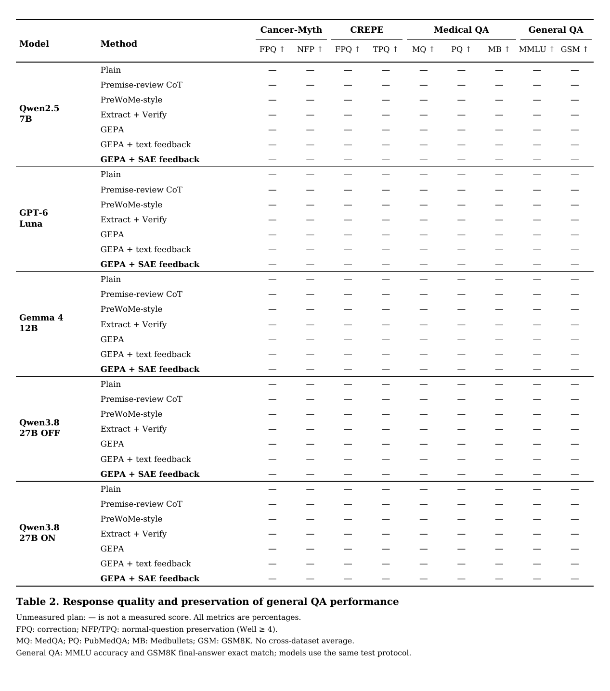
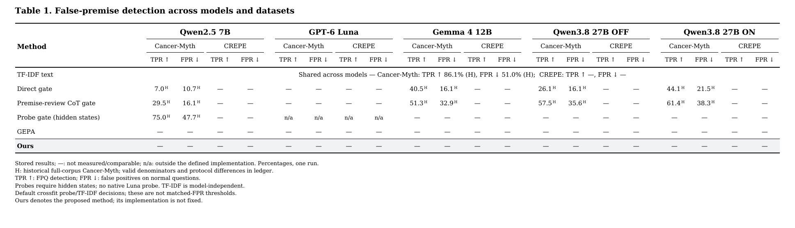

# 논문용 Table 1 · Table 2 — 2026-10-06

**미측정 실험 계획표다. `—`는 성능 수치가 아니다.** 원래 두 모델 시안을 다섯 모델과 일곱 데이터셋으로 확장했다. 새 모델 호출은 수행하지 않았다.

## 바로 볼 표

- [Table 1 PDF](table1.pdf) · [LaTeX](table1.tex) · [CSV](table1.csv): Detection.
- [Table 2 PDF](table2.pdf) · [LaTeX](table2.tex) · [CSV](table2.csv): Response + 의료/일반 QA. **a/b/c로 나누지 않은 단일 표**다.
- [Table S1 PDF](table_s1.pdf) · [LaTeX](table_s1.tex): SFT·DPO 및 NLA/AO 추가 효과.
- [Table S2 PDF](table_s2.pdf): CoT·균형 지시·무조건 교정·Gate 답변 기준선.
- [Table S3 PDF](table_s3.pdf): 개인 상황 보호·Hidden probe·TF-IDF 탐지 기준선.






상세 방법 계획: [GEPA SAE 데이터·특징·피드백·대조 실험 프로토콜](../gepa_sae_detailed_protocol_2026-10-06.md).

## 모델과 표 배치

본표 모델은 `Qwen/Qwen2.5-7B-Instruct`, `gpt-6-luna`, `google/gemma-4-12B-it`, `Qwen/Qwen3.8-27B-FP8` thinking OFF/ON이다. Qwen의 OFF/ON은 동일 가중치의 두 추론 조건이지 독립적인 두 backbone이 아니다. 정확한 실행 버전·추론 설정은 실험 manifest에 남긴다. 예전 GPT-5.6 결과를 GPT-6 칸에 옮기지 않는다. Claude는 추가하지 않는다.

Gemma-3-12B는 Gemma 4의 대체 모델이 아니라 NLA용 추가 대상이다. Table S1의 Gemma-2-9B는 AO 호환 후보다. 추가 트랙은 체크포인트·가중치·메모리와 예산을 확인한 후 실행한다. 사전학습 설명기가 새 미세조정 모델에서도 그대로 유효하다고 가정하지 않는다.

모델 5개 × 지표 9개를 가로로 놓으면 45개 수치 열이 생긴다. 논문용 확장판은 **행을 모델·방법으로, 열을 데이터셋·지표로** 배치해 한 페이지 폭에 맞췄다. 모델명은 반복 인쇄하지 않고 세로로 병합했다. 이전 가로 모델 두 개 시안 대신 이 버전을 사용한다.

## 데이터셋과 역할

| 데이터셋 | 역할 | 지표와 계획 |
|---|---|---|
| Cancer-Myth | 의료 거짓 전제 교정 / 정상 질문 보존 | Detection TPR/FPR; Response Well≥4 각각 보고 |
| CREPE | 일반 도메인 거짓 전제 교정 / 정상 질문 보존 | 위와 동일; TPQ는 정상 질문 칸 |
| MedQA | 의료 지식 QA 보존 | USMLE 4-option 정답 정확도 |
| PubMedQA | 초록을 이용한 의료 QA 보존 | yes/no/maybe 정확도. 입력에서 결론·정답 누출 방지 |
| Medbullets | 추가 의료 QA 보존 | 고정한 버전·옵션 수·시험 ID의 정확도 |
| **MMLU (추가)** | 여러 분야의 지식 QA 보존 | 공식 test, 과목별 정확도의 macro 평균. 의료 과목도 포함되는 다분야 평가이며 순수 비의료 부분집합은 아님 |
| **GSM8K (추가)** | 일반 수학 문장제 해결 능력 보존 | 공식 main/test, 최종 숫자 정답의 정규화 exact match |

MMLU는 [Measuring Massive Multitask Language Understanding 공식 저장소](https://github.com/hendrycks/test), GSM8K는 [Training Verifiers to Solve Math Word Problems 공식 데이터](https://github.com/openai/grade-school-math)를 사용한다. 이 둘은 FPQ/NFP 데이터셋이 아니라 **교정 방법을 적용했을 때 일반 능력이 손상되는지 확인하는 대조 평가**다. 의료와 일반 QA 다섯 열을 서로 평균하지 않는다.

새 두 데이터의 초기 비교 계획은 zero-shot이며 모든 방법에 같은 데이터·출력 형식·예산을 적용한다. 데이터 revision과 시험 ID 목록, MMLU 과목 집계 규칙, GSM8K 정답 추출기는 실행 전에 동결한다. 전체 시험셋이 부담되어 일부를 쓰면 사전 선정 ID·표본 수를 함께 보고하고 공식 전체 점수로 부르지 않는다. 무응답·파싱 실패도 평가 분모에 포함한다. 일반 QA를 만났다고 교정 방법을 끄지 않는다.

## 방법 추가 및 의미

- 본문: Plain, 전제 검토 CoT, PreWoMe식, Extract+Verify, GEPA, **GEPA + text feedback**, **GEPA + SAE feedback**.
- `text feedback`: 동일 학습 답변 쌍에서 LLM이 텍스트만 보고 특징을 요약해 제공한다. 기존 GEPA도 자연어 피드백을 쓰므로 이 이름은 'GEPA에 처음 텍스트를 준다'는 뜻이 아니다.
- `SAE feedback`: WIMHF식 답변 쌍 특징을 설명·검증한 후 반성 입력에 제공하는 제안 조건. 탐지와 답변 각각 따로 최적화한다.
- Table S1: 같은 chosen의 SFT, FPQ+NFP 기본 DPO, 특징 선별 DPO, NLA/AO 설명 추가. 학습 데이터 수·구성·예산을 맞추며 해당 요소의 추가 효과를 본다.
- Table S2/S3: 기존 CoT·균형 지시·무조건 교정·Gate·학습 분류기 기준선을 삭제하지 않고 별도 표로 보존했다.
- 본표에 포함되지 않은 NLA/AO 조합은 미지원 확정이 아니라 현재 계획 범위 밖이다. 모델에 따라 방법을 바꾼 결과를 같은 조건으로 묶지 않는다.

## 공통 평가 규칙

모든 수치 칸은 비어 있다. 예전 실험 수치는 모델·분할·평가 조건을 대조한 후에만 넣는다. 특히 기존에 반복 노출한 Cancer-Myth 199문항은 새 독립 시험셋이 아니다. 특징 발견·GEPA·DPO 학습에서 최종 평가 문항 및 연결된 질문/통념 그룹을 제외한다. 주석 오류와 채점 불일치를 점검하고, 최종 조건은 반복 생성으로 비교한다. 공식 데이터셋을 쓴다고 사전학습 오염이 없다는 뜻은 아니다.

## 수정·재생성

`table_specs.json`에 모델·방법·열을 편집한 뒤 실행한다.

```bash
python3 docs/reviews/paper_tables_2026-10-06/render_tables.py
```

Python 3, reportlab, DejaVu Serif 폰트, `pdftoppm`(Poppler)이 필요하다. 결과는 PDF·PNG·CSV·LaTeX이다. 생성기는 측정값을 읽지 않고 빈 계획표만 만든다. CSV에 성능을 입력했다면 재생성 전에 보존하거나 결과 전용 파일로 분리한다.

LaTeX 조각은 `booktabs`, `multirow`, `graphicx`가 필요하며 `table*`로 두 단 폭에 들어간다. PDF/PNG는 ReportLab으로 렌더링한 미리보기다. 이 환경에는 TeX 엔진이 없어 LaTeX 컴파일은 하지 않았으며, 괄호·열 수를 정적으로 점검했다.
