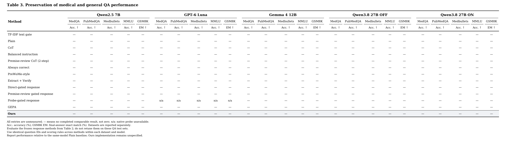

# 논문 비교표 — Detection / Response / QA Preservation

## 현재 표와 fold 평가 계획 (2026-10-07)

Table 2·3은 합의한 방법 순서로 갱신했다: Plain, Balanced instruction, CoT, PreWoMe, Extract + Verify, TF-IDF text gate, Direct gate, CoT gate, Probe gate, GEPA-gate, GEPA, GEPA (both stages), Ours. TF-IDF text gate는 Extract + Verify 바로 아래에 놓았다. Gate 이름의 `response`를 제거했으며 Table 2·3에서는 모두 최종 답변 방법을 뜻한다. Table 1의 판정 성능과 구분한다.

**숫자 오른쪽 위의 출처 위첨자는 제거했다. 분모·평가 집단·judge·원본 위치는 result_sources.md와 measured_results.json/CSV에 그대로 보존한다.** 현재 Table 2는 재사용 가능한 과거 측정 54칸을 채운 진행표이며, 아직 공통 fold로 평가를 완료한 표가 아니다. Table 3은 호환되는 완료 결과가 없어 공란이다. 새 수치를 생성하거나 재채점하지 않았다.

- 공개 모델 Cancer-Myth는 전체 자료 대상의 과거 집계(최대 FPQ 583 / NFP 149), Luna Cancer-Myth는 공통 FPQ 99 / NFP 100, Luna CREPE는 FPQ 751 / TPQ 2,253이다. 공개 모델과 Luna의 judge도 다르다. 분할과 judge 차이는 위첨자 대신 표 아래에 표시했다.
- **현재 Direct gate·CoT gate 값은 과거 이진 판정에 따라 Plain/무조건 교정 답변을 선택한 결과다.** Two Axes식 점수로 새로 측정한 Direct와 검토문까지 답변에 전달하는 새 CoT 결과가 아니다. 새 방식 결과가 확보되면 교체한다. 이름만 바꿔 동일한 실험이라고 주장하지 않는다.
- `GEPA`는 저장된 직접 답변 최적화 결과다. `GEPA-gate`(탐지 지시만 최적화), `GEPA (both stages)`(탐지·후속 답변 지시 최적화)는 아직 수치를 넣지 않았다. 과거 100/100 계열 GEPA를 fold GEPA로 재분류하지 않는다.
- Balanced instruction의 호환되는 현재 모델·평가 조건 수치는 원장에 없어 공란이다. GPT-5.6-Luna 과거 값을 GPT-6-Luna 칸에 옮기지 않았다. Balanced는 FP Identification의 재현으로 표시하지 않는다.
- 과거 `Premise-review CoT (2-step)`와 `Always correct`의 16칸은 현재 축약한 방법 목록에서 제외하고 `excluded_review_control_results.json`에 보존했다. 기존 주석·원장 링크는 과거 방법의 설명으로 남긴다.

**Table 2의 Cancer-Myth 최종 평가 계획은 공통 grouped 3-fold의 out-of-fold 예측 합산이다. CREPE는 기존 고정 train/dev/test를 유지한다.** 3-fold 선택은 확정했지만 실제 적격 ID·그룹 감사와 split manifest 생성은 아직 완료하지 않았다. 각 외부 학습 영역을 다시 opt_train/opt_dev로 나누고 모든 모델·방법이 같은 배정을 사용한다. 최초 비교는 fold당 seed 하나이며 fold 간 변동을 최적화 seed 반복으로 간주하지 않는다. 고정 방법의 답변과 채점은 규약에 맞으면 재사용한다. TF-IDF·Probe의 학습·설정·임계값 선택, GEPA 및 Ours의 학습형 특징 발견·선택·최적화는 각 평가 fold를 제외한 자료에서 수행한다. 각 문항의 held-out 성공 여부를 한 번씩 합산한다. few-shot 예시와 겹친 문항은 공통 평가 대상에서 제외한다. 이미 자료를 보고 방법을 설계한 이력은 fold 분할로 없어지지 않으므로 탐색 평가로 밝힌다.

Table 3은 Table 2에서 학습한 방법을 동결해 일반·의료 QA에 적용한다. 여러 fold checkpoint 중 어느 것을 평가하거나 평균할지는 사전에 정하고 QA test로 고르지 않는다.

2026-10-07 갱신. **평가 과제에 따라 Table 1(탐지), Table 2(교정·정상 질문 보존), Table 3(일반 QA 보존)으로 나눴다.** 학습 비교용 SFT·DPO·`Plain (LoRA cohort)`를 제외하고 개인 상황 보존 변형과 중복되는 과거 Direct gate 실행도 메인 표에서 제외해 저장 결과 74칸을 표시했다(Table 1: 20칸, Table 2: 54칸, Table 3: 미측정). 일반 `Plain`은 유지했다. 추가로 2-step 검토·무조건 교정 대조 16칸은 `excluded_review_control_results.json`에 보존했다. 학습 비교 6칸은 `excluded_training_results.json`, 개인 상황 보존 변형 2칸은 `excluded_scope_results.json`과 출처 스냅샷에 보존했다. 중복 Direct gate 실행 2칸은 `excluded_duplicate_gate_results.json`에 보존했다. 새 생성·채점·학습은 하지 않았다.

- [Table 1 PDF](table1.pdf) · [PNG](table1.png) · [LaTeX](table1.tex) · [CSV](table1.csv): 거짓 전제 탐지.
- [Table 2 PDF](table2.pdf) · [PNG](table2.png) · [LaTeX](table2.tex) · [CSV](table2.csv): Cancer-Myth·CREPE 답변의 FPQ 교정·NFP/TPQ 보존.
- [Table 3 PDF](table3.pdf) · [PNG](table3.png) · [LaTeX](table3.tex) · [CSV](table3.csv): 의료·일반 QA에서의 답변 능력 보존.
- [분모·출처·미반영 사유](result_sources.md) · [수치 원장](measured_results.json).

**제안 방법의 표시명은 `Ours`다. SAE 사용을 확정하지 않는다.** `GEPA + text features` 행은 삭제했다. 과거 S1/S2/S3의 측정값을 옮겼으며, 표를 나눈 이전 버전은 Git 이력에 남아 있다. 사용자 스케치에 맞춰 **모델 → 데이터셋 → 지표**의 3단 헤더를 사용한다. 방법은 왼쪽에 한 번씩만 나열한다. Table 1과 Table 2는 모델당 Cancer-Myth·CREPE의 지표 4열을 사용한다. Table 3은 MedQA·PubMedQA·Medbullets·MMLU·GSM8K의 Acc./EM 5열을 사용한다. 모델 구성은 그대로 유지해 Table 2는 종전 45열에서 20열로 줄었고, Table 3은 25열이다. PDF는 글자 크기를 유지한 사용자 지정 가로 용지이며 A4에 강제로 축소하지 않았다. 아직 완료 결과가 없는 일반 QA 칸은 `—`다. TF-IDF 탐지는 모델 독립적인 공통 행으로 한 번만 표시한다.




## Table 1 해석과 실행 범위

Table 1에서는 직접 답변형 Ours를 제외한다. 탐지 프롬프트 최적화는 Table 1·2 모두 `GEPA-gate`이며, Table 2의 `GEPA`는 직접 답변 최적화다. 이름을 맞춘 것이며 새 측정은 아니다.

현재 TPR/FPR은 각 방법의 저장된 운영점을 함께 보여 준다. 임계값이 다르다는 이유만으로 비교가 불가능한 것은 아니다. 같은 평가 자료에서 한 방법의 TPR이 높고 FPR도 낮으면 관찰값 기준으로 우세하지만, 둘 다 높으면 선호하는 오류 비용이나 제약 없이는 단일 순위를 매길 수 없다. 표본 불확실성·서로 다른 프로토콜도 함께 고려한다.

연속 탐지 점수가 확보되면 AUROC를 별도 분석으로 보고하고, 선택한 임계값의 TPR/FPR을 현재 표에 유지한다. 목표 FPR 조건의 임계값은 내부 dev에서 정하고 외부 평가에서는 실제 달성한 FPR과 TPR을 보고한다. test FPR을 맞추려고 임계값을 재선택하지 않는다. 이 변경으로 표의 열을 지금 추가하지는 않는다.

Yes/No만으로도 수학적으로 AUROC를 계산할 수 있으나, 0/1 점수의 AUROC는 `(TPR + 1 - FPR) / 2`로 balanced accuracy와 같다. 이를 연속 점수의 순위 성능과 혼동하지 않는다. 연속 점수가 없는 행의 순위 AUROC는 '연속 점수 미제공'으로 구분한다. 공개 모델 Direct의 토큰 점수 방식과 Luna CLI의 이진 출력은 별도 구현이며, 기존 판정 비율에서 연속 점수를 복원하지 않는다.

현재 모델·데이터셋 열은 유지한다. 빈칸은 모든 조합의 실행 확약이 아니다. 실행 우선순위는 Luna의 두 데이터셋 비교와 공개 모델의 저장 Cancer-Myth 결과 활용이며, 일반화 주장을 여러 모델에 확장하려면 선택한 공개 모델에서도 공통 방법을 일반 도메인에 평가해야 한다. 공개 모델 CREPE를 일괄 삭제하거나 Probe만 실행하기로 확정하지 않았다. Luna의 native hidden probe는 계속 해당 없음이다.

## Always correct: 저장된 gate의 분석용 대조

Always correct는 모든 문항을 교정 경로로 보내는 조건이다. **FPQ 성능의 상한은 아니다.** 어떤 FPQ에서는 저장 Plain 답변이 성공하고 교정 답변이 실패할 수 있어, 문항별 경로 선택은 Always correct보다 높아질 수 있다. 고정된 두 답변 중 점수가 좋은 답변을 선택하는 best-answer oracle이 이 저장 답변 풀에 대한 상한이다. 정답 라벨 gate(FPQ→교정, NFP→Plain)는 이 oracle과 다르다. 두 진단값은 문항별 공통 ID·채점 규약을 맞춘 뒤 계산해야 하며 여기서는 새로 계산하지 않았다.

아래는 제외 원장에서 가져온 Always correct 대조값이다. 새 3-fold 결과가 아니며, 위 Table 2의 gate가 사용한 교정 경로를 설명한다.

| 모델 | FPQ 교정 (%) | NFP 보존 (%) |
|---|---:|---:|
| Qwen2.5 7B | 56.9 (332/583) | 21.5 (32/149) |
| Gemma 4 12B | 72.0 (420/583) | 2.0 (3/149) |
| Qwen3.8 27B OFF | 71.0 (414/583) | 28.9 (43/149) |
| Qwen3.8 27B ON | 83.4 (486/583) | 5.4 (8/149) |

출처: [제외 대조 원장](excluded_review_control_results.json). GPT-6 Luna의 호환 측정은 없어 추가하지 않았다. 메인 Table 2·3의 합의한 13개 행은 유지한다.

## GEPA와 삭제한 text features의 차이

기존 GEPA도 실행한 질문·답변·점수와 자연어 채점 이유를 이용해 프롬프트를 수정한다. 이전에 제안한 `GEPA + text features`는 여러 학습 답변을 별도로 비교해 공통 특징을 요약하고, 그 설명을 기존 GEPA 피드백에 추가하는 **우리가 설계한 대조 조건**이었다. 독립적인 기존 논문 방법이나 공식 GEPA 변형 이름이 아니다. 최적화 알고리즘과 점수는 같고 추가 입력만 달라지는 조건이므로 주 결과표의 기존 방법에서 제외했다.

Ours의 구체 구현은 미정이다. [GEPA·SAE 상세 계획](../gepa_sae_detailed_protocol_2026-10-06.md)은 가능한 후보와 대조 실험의 기록이며 최종 방법을 확정한 문서가 아니다. 기존 GEPA 수치는 과거 실행 결과이고, Ours 비교에서 조건·예산을 변경하면 GEPA도 같은 조건으로 다시 평가한다.

## 기존 비교 방법과 배치

Table 1은 TF-IDF를 첫 번째 행에, Table 2·3은 Extract + Verify 다음 행에 둔다. 질문을 바로 주고 거짓 전제 유무만 묻는 판정은 `Direct gate`, 그 판정으로 답변 경로를 선택한 결과는 `Direct gate`로 표기한다. `Plain`은 별도 교정 지시 없이 답변하는 조건이므로 `Plain gate`라는 이름은 쓰지 않는다.

| 방법군 | Table 1: Detection | Table 2: Response | 역할 |
|---|---|---|---|
| 직접 판정 | Direct gate | Direct gate | 명시적인 LLM 판단으로 답변 경로 선택 |
| 검토 기반 판정 | CoT gate | CoT gate | 검토 후 판정하여 답변 경로 선택; 현재 수치는 과거 구현 |
| 내부 분류기 | **Probe gate (hidden states)** | **Probe gate** | 내부 표현을 학습한 분류기로 선택적 교정 |
| 텍스트 분류기 | TF-IDF text (모델 독립 공통 행) | TF-IDF text gate | 내부 접근 없이 질문 텍스트로 판정 |
| 구조화 파이프라인 | 별도 성능 대입 없음 | PreWoMe, Extract + Verify | 전제 추출·검토·답변 |
| 프롬프트 최적화 | GEPA-gate | GEPA-gate, GEPA, GEPA (both stages) | 각각 탐지 / 직접 답변 / 탐지·후속 답변 최적화 |
| 단순 지시 대조 | — | Plain, CoT, Balanced instruction | 고정 답변 지시; Always correct는 아래 분석용 대조에 보존 |
| 제안 방법 | 해당 없음 | Ours | 첫 버전은 직접 답변형; 특징 구성과 성능은 아직 미정 |

[Two Axes of LLM Abstention: Answer Correctness and Question Answerability](https://arxiv.org/html/2607.08456v1)의 §6은 내부 probe로 일반 답변과 전제 검토 지시를 선택하는 비교를 제공한다. **Probe gate를 넣을 직접적인 선행 연구 근거**다. 다만 현재 저장된 우리 response gate 값은 Plain/무조건 교정의 저장 답변을 선택한 값이다. 그 논문의 지시·학습 분할·threshold·평가까지 그대로 재현한 수치라고 부르지 않는다. 앞으로 선행 방법을 재현할 때에는 gate별로 같은 답변 경로를 쓰고 분할·threshold 선택을 통제한다.

Probe는 해당 모델의 내부 상태가 필요하다. 공개 모델 Qwen/Gemma에 배치했고 GPT-Luna에는 native probe 행을 두지 않았다. 다른 모델의 probe로 Luna를 라우팅한다면 별도의 transfer 조건이다. TF-IDF 판정은 모델 독립적이지만 그 판정으로 고르는 답변의 품질은 모델별로 다르므로 Response에서는 모델별 행이 필요하다.

## Method 정의: 신호·판정·답변을 구분

표의 행은 완성된 답변 방법을 뜻한다. GEPA는 프롬프트를 얻는 최적화 절차이고, gate는 판정으로 행동을 고르는 구성요소라 같은 층위의 용어가 아니다. 따라서 아래처럼 실제 실행 단위를 함께 정의한다.

| 방법군 | 현재 행 | 답변을 만드는 방식 |
|---|---|---|
| 고정 답변 지시 | Plain, CoT, Balanced instruction | 고정 지시로 답변 |
| 전제 검토 파이프라인 | PreWoMe, Extract + Verify | 중간 검토 내용 또는 주장별 판정을 최종 답변 입력으로 전달 |
| 선택적 경로 | TF-IDF text gate, Direct gate, CoT gate, Probe gate | gate 판정으로 Plain/무조건 교정 경로를 선택 |
| 최적화·제안 방법 | GEPA, Ours | GEPA 행은 최적화한 답변 프롬프트. Ours의 구현은 미정 |

### Extract + Verify의 정확한 정의

현재 Luna 실행은 [Well 공개 구현](https://github.com/ShenranTomWang/Well/blob/6c9770f65da6e9c50250cf94e35b07f258288e38/prompting/run_presupposition_pipeline.py)의 no-RAG 조건이다. 질문에서 전제 목록을 뽑고 각 전제를 개별적으로 True/False 판정한 뒤, 거짓으로 판정한 전제에 대한 피드백과 원 질문을 답변 생성기에 준다. 현재 검증 입력에는 원 질문이 없고 개별 전제만 있다. 검증 결과를 참고해 새 답변을 생성하며, 저장된 Plain/무조건 교정 답변을 하나 고르는 현재 routing 행과는 다르다. 넓게 보면 이 방법에도 교정 여부를 결정하는 판정 기능은 있지만, 개별 주장 검증과 질문 단위 gate를 동일한 구현으로 취급하지 않는다.

Table 1에 이 방법의 탐지 성능을 넣으려면 예컨대 “하나 이상의 전제가 False이면 질문을 FPQ로 판정”이라는 집계 규칙을 별도로 정의해야 한다. 이는 답변 점수와 다른 지표이며 추출·파싱 실패를 정상 질문으로 간주해서는 안 된다. 아직 이 규칙의 결과를 Table 1에 추가하지 않았다.

PreWoMe는 동일한 추출 목록을 받지만 질문·목록 전체를 보고 자유 서술 Feedback/Action을 만든다. Extract + Verify는 개별 전제를 이진 판정한다. 현재 두 방법이 같은 추출 목록을 공유한다는 사실은 두 전체 방법이 같다는 뜻이 아니다.

### Gate 계열과 선행 연구의 범위

[Two Axes of LLM Abstention: Answer Correctness and Question Answerability](https://arxiv.org/html/2607.08456v1)의 §5는 직접 판정, 자기평가, 출력 확신도, 표면 텍스트, hidden probe 및 평균 차이 방향을 탐지 신호로 비교한다. §6의 실제 답변 routing은 일반 답변과 조건부 전제 검토 지시를 고르며, 같은 routing budget의 무작위 선택도 대조한다. 모든 탐지 신호를 답변 gate로 실행한 것은 아니다. 우리의 Plain/무조건 교정 routing은 그 조건부 검토 지시와 같지 않다.

[Detecting (Un)answerability in Large Language Models with Linear Directions](https://aclanthology.org/2026.eacl-long.29/)는 답변 불가능성을 읽는 내부 방향과 개입을 다룬다. 학습한 logistic probe 외 내부 방향 기반 점수도 후보지만, 원 연구의 주 과제인 답변 가능성 탐지와 우리의 FPQ 교정을 동일한 과제라고 보지 않는다.

현재 표의 gate가 가능한 모든 gate를 포괄하는 것은 아니다. 검토할 추가 항목은 다음과 같다.

- **검증 결과 기반 gate:** 전제별 판정을 질문 단위로 집계한 뒤 공통 답변 경로로 연결. 현재 Extract + Verify 파이프라인과 구분하는 추가 실험이다.
- **자기평가·출력 확신도:** 답할 수 있는지, 생성한 답이 맞는지, 답변 확률 등의 신호. 낮은 확신도가 곧 거짓 전제를 뜻하지 않으며, 생성 후 신호는 호출 비용도 다르다.
- **내부 방향:** logistic probe와 평균 차이 방향 등을 구분. 현재 원장에도 mean 신호는 있으나 main 표의 hidden logistic 값과 합치지 않았다.
- **무작위 routing:** 같은 비율로 교정 경로를 켜는 대조군. 분류의 효과와 단순한 교정 횟수 감소를 구분하기 위한 분석 조건이다.
- **항상/전혀 routing하지 않음:** 현재 Always correct/Plain이 양 끝 조건이다. 정답 라벨 routing은 진단용으로만 둘 수 있고 배포 가능한 방법은 아니다.

공정한 gate 비교는 답변 경로를 고정하고 gate 신호만 바꾼다. 학습·임계값 선택에는 test를 쓰지 않고 AUROC와 선택한 임계값의 TPR/FPR, 최종 답변의 FPQ 교정·NFP 보존, 추가 호출 비용을 함께 보고한다. 판정 정확도와 최종 답변의 교정 성공률은 서로 대체할 수 없다. 새로운 gate 행이나 수치는 이 정의를 확정해 실행한 뒤 추가한다.

## 현재 CoT gate 수치의 과거 구현: Premise-review CoT gate

1. 원 질문에서 사실적 전제를 검토하는 글을 생성한다. 잘못된 전제와 교정 정보를 찾고 타당한 전제에서는 오류를 만들지 않도록 지시한다.
2. **질문 + 검토문**으로 오류 있음/없음을 판정한다. Qwen2.5는 Yes/No 토큰 점수 비교, Gemma/Qwen3.8은 생성 JSON이라 판정 출력 절차는 다르다.

현재 Table 1의 CoT gate 수치는 이 과거 판정 결과다. 메인 표에서 제외한 과거 `Premise-review CoT (2-step)` 대조는 2단계에서 판정 대신 실제 답변을 생성한다. `CoT gate`는 gate 판정으로 저장된 Plain/무조건 교정 답변을 선택한다. 2-step gate가 최종 답변 생성까지 두 번 호출했다는 뜻은 아니다. **비-gate 조건에서는 검토문의 내용이 최종 답변 입력으로 들어가지만, 현재 gate 조건에서는 검토문이 판정에만 쓰이고 최종 선택에는 이진 판정만 사용된다.** 따라서 둘은 중간 검토를 공유해도 최종 답변을 만드는 방식이 다르다.

## Gate와 추출·검토 파이프라인의 구분

이 표에서 gate는 **오류 있음/없음 판정으로 Plain과 교정 답변 경로를 선택하는 장치**를 뜻한다. 전제를 검토하는 모든 방법을 gate라고 부르지는 않는다.

| 표의 방법 | 실제 과정 | 구분 |
|---|---|---|
| CoT gate (Table 1, 과거 구현) | 질문 → 전제 검토문 → 오류 있음/없음 | 탐지기 |
| CoT gate (Table 2) | 위 gate 판정 → 저장된 Plain/무조건 교정 답변 중 선택 | 같은 gate를 사용한 답변 평가 |
| Premise-review CoT (2-step, 메인 표 제외) | 질문 → 전제 검토문 → 이를 참고해 새 답변 생성 | 이진 경로 선택 없는 답변 파이프라인 |
| PreWoMe | 전제 목록 → 질문·목록을 보고 문제점과 대응 방침 → 새 답변 | 구조화 검토 파이프라인 |
| Extract + Verify | 전제 목록 → 전제마다 true/false → 거짓 전제에 관한 피드백으로 새 답변 | 주장별 검증 파이프라인 |

PreWoMe과 Extract + Verify의 현재 Luna 값은 Well 공개 템플릿·few-shot·파서를 재사용한 no-RAG 실행이다. 두 방법의 추출 입력·목록을 공유했고, 검토 방식이 다르다. 이진 전제 검증을 한다는 이유만으로 질문 단위의 Plain/교정 경로 선택 gate와 같은 방법으로 묶지 않는다. 구현은 [fpqa_well_pipelines.py](../../../src/fpqa_well_pipelines.py)에 있다.

메인 표에서 제외한 `Extract+Verify (scope)`는 이전 자체 구현이다. 추출할 때 주체·조건·불확실성·개인 상황을 보존하라는 지시를 넣고, 빈 목록을 허용하며, 검증에 원 질문도 함께 준다. 현재 Well 버전과는 few-shot·출력 파서 등도 달라 **scope 문구 하나의 효과를 분리한 ablation이 아니다.** 독립적인 기존 논문 방법명도 아니다.

메인 표에서 제외한 `Self-gated FP identification`은 모델이 질문의 거짓 전제 유무를 먼저 판정하고, Yes이면 무조건 교정 지시로, No이면 Plain으로 답을 생성한 과거 실행이다. **설계상 Direct gate 계열이며 별개의 핵심 방법이 아니다.** 현재 Direct gate는 저장된 판정과 두 답변을 사후 결합한 결과다. 이전 생성 실행과 현재 routing 집계는 원장과 실행 조건이 다르므로 두 값을 합치지 않았다. 예를 들어 자체 생성 코드의 임계값은 `>= 0.5`이고 기존 Qwen Direct 판정 원장은 동점 음성 규칙이다. 실제 점수 차이의 원인을 이 차이 하나로 단정하지 않는다. `legacy`는 과거 실행임을 표시하기 위해 우리가 붙였던 이름으로, 원 논문의 공식 방법명이 아니다. 메인 표에서는 해당 중복 행을 제거하고 Direct gate를 남겼다. 통일된 본 실험에서는 하나의 Direct gate 조건으로 평가한다.

측정이 없는 방법·모델 조합은 `—`다. `n/a`는 현재 정의한 native hidden-state probe를 쓸 수 없는 Luna 조합에만 남겼다.

## Table 3의 평가 과제

Table 2는 “거짓 전제는 교정하고 정상 질문에는 적절히 답하는가”를 측정한다. Table 3은 **동일한 답변 방법을 적용해도 의료·일반 QA의 정답률이 유지되는가**를 측정하는 별도 평가다. FPQ/NFP로 나누거나 거짓 전제를 합성하는 데이터셋이 아니다.

- Table 2와 같은 방법 행을 유지한다. 각 방법과 GEPA 프롬프트를 동결한 뒤 QA에 적용한다. QA test에 맞춰 GEPA를 다시 최적화한 결과를 보존 성능으로 보고하지 않는다.
- 모델·데이터셋 내에서 모든 방법의 평가 ID와 정답 채점 규칙을 동일하게 맞춘다. 데이터셋끼리 문항 수가 같을 필요는 없다.
- 선택형·단답형 출력 형식은 해당 데이터셋에 맞춰 공통으로 고정한다. 이 어댑터는 방법별로 유리하게 수정하지 않는다.
- 같은 모델의 Plain을 기준으로 보존 여부를 읽는다. Acc./EM 절대값을 표에 넣고, 필요하면 Plain 대비 변화량을 추가 분석한다.
- 현재 Table 3은 평가 계획표다. 완료 수치는 아직 없으며, 새 모델 호출은 하지 않았다.

## 일반 도메인에서 TF-IDF gate를 쓰는 방법

**CREPE의 FPQ/정상 질문 성능(Table 1·2)**을 측정한다면 CREPE train으로 TF-IDF vocabulary/IDF와 분류기를 학습하고 dev로 임계값을 정한 뒤 test를 평가할 수 있다. Cancer-Myth에서 학습한 분류기를 그대로 CREPE에 적용하는 것은 별도의 도메인 전이 실험이다. 두 설정을 같은 결과로 합치지 않는다. 모든 방법은 비교하려는 설정에 맞춰 같은 train/dev/test ID 정책을 사용한다.

**일반 QA 능력 보존(Table 3)**에서는 출처를 명시한 FPQA 학습 자료에서 얻은 gate를 동결해 사용한다. Cancer-Myth/CREPE별 gate가 따로 있다면 어느 checkpoint를 전이하는지 실행 전에 고정하며, 대상 QA 성능을 보고 유리한 쪽을 고르지 않는다. 현재 표는 결과 칸만 준비했으며 이 source checkpoint는 아직 확정하지 않았다.

1. 새 QA 질문을 기존 vocabulary/IDF로 변환한다. QA test를 포함해 vectorizer를 다시 fit하지 않는다.
2. 동결된 분류기·임계값으로 거짓 전제 유무를 판정한다.
3. 음성이면 Plain, 양성이면 동일한 교정 지시를 적용한 답변 경로를 사용한다. TF-IDF 자체는 답변 모델이 아니다.
4. 각 경로에서 생성한 최종 답변을 해당 QA 정답 기준으로 채점한다. 같은 모델의 Plain과 비교한다.

Probe gate도 layer·분류기·임계값을 동결하고 새 질문의 hidden state를 읽는다. LLM gate는 판정 프롬프트를 동결한다. QA 보존 평가를 위해 모든 QA 질문에 임의의 NFP 라벨을 붙여 분류기를 새로 학습하지 않는다.

보조 지표로 교정 경로 선택률과 Plain 정답→오답 전환을 기록할 수 있다. 별도 전제 주석이 없는 QA에서는 경로 선택률을 바로 오탐률이라고 부르지 않는다. 선택형 QA의 틀린 선택지 역시 질문이 참이라고 전제한 주장은 아니므로, 선택지의 존재만으로 거짓 전제로 분류하지 않도록 입력·판정 대상을 공통 규약에 명시한다.

## GEPA와 고정 프롬프트의 비교 조건

Plain을 전체 문항에 실행하는 것은 가능하다. 하지만 **GEPA와 직접 비교하는 수치는 같은 test ID에서 집계한다.** GEPA는 train에서 지시를 최적화하고 dev에서 후보를 선택한 뒤, 고정된 test에서 평가한다. Plain·CoT 등 학습하지 않는 방법도 같은 test로 평가해야 방법 간 차이를 읽을 수 있다. 전체 Plain 집계와 일부 test GEPA 집계를 직접 비교하지 않는다. 이미 전체 답변이 저장돼 있다면 공통 test ID를 골라 재집계하면 된다.

[Well Actually §2.2 및 부록 A/C](https://arxiv.org/html/2608.06539)도 최적화 자료와 평가 자료를 구분한다. 논문의 GEPA(FPQ)와 GEPA(FPQ+TPQ)는 최적화에 포함하는 질문 유형의 차이다. 현재 표의 GEPA는 FPQ와 정상 질문을 함께 사용하는 기존 실행이며, FPQ-only 조건을 혼합한 행이 아니다.

현재 Luna Cancer-Myth 네 방법은 공통 99 FPQ/100 NFP, CREPE Plain/GEPA는 공통 751 FPQ/2,253 TPQ로 맞췄다. 다른 모델의 H 전체 집계와 Luna의 L 부분 집계는 아직 통일 평가가 아니다. 또한 L은 이미 개발 분석에 노출되어 새 방법의 독립 일반화 시험으로 볼 수 없다.

## 수동 지시 변형과 대조 조건의 위치

- **Direct + scope protection:** Direct gate에 개인 상황의 범위를 보존하라는 지시를 추가한 우리 대조 조건이다. 예를 들어 “담당의가 이 환자에게 수술을 권했다”를 “모든 환자에게 수술이 필요하다”로 넓혀 반박하지 않도록 한다. 기존 GPT-5.6 측정치를 현재 GPT-6 칸에 옮기지 않았으며, 이번에는 방법 행 자체를 메인 표에서 제외했다.
- **Always correct:** 모든 질문에 “이 질문에는 하나 이상의 거짓 전제가 있다고 판정되었다”고 주고, 이를 교정한 뒤 답하도록 하는 무조건 교정 대조군이다. “틀렸을 때만 고쳐라”라는 조건부 지시가 아니며, 실제 정답 라벨을 제공한 oracle도 아니다. 정상 질문에도 같은 지시를 적용한다.

개인 상황 보존은 Cancer-Myth 오류 분석에서 얻은 규칙이므로 독립적인 주요 방법으로 나열하지 않는다. GEPA가 이러한 규칙을 자동으로 발견할 수 있지만, 손으로 추가해 얻은 결과를 GEPA 성능으로 재분류할 수는 없다. 이후 선택한 GEPA 프롬프트에 실제로 해당 규칙이 들어 있는지 보고하거나, 그 규칙을 제거한 조건과 비교하는 분석에 사용할 수 있다. 과거 scope 변형은 여러 설정이 달라 규칙 하나의 효과를 측정한 ablation으로 주장하지 않는다.

## 데이터·모델·측정 범위

| 원장 내부 코드(표에는 표시하지 않음) | 평가 자료 | 주의점 |
|---|---|---|
| H | Cancer-Myth 전체 583 FPQ / 149 NFP 대상 | 일부 Qwen 행은 유효 점수 분모가 작음. 모델별 지시·실행 조건 차이 있음 |
| L | GPT-6 Luna Cancer-Myth 99 FPQ / 100 NFP | few-shot 중복 fpq_291을 네 방법 모두에서 제외. 이미 분석에 노출된 문항 |
| R | GPT-6 Luna CREPE 751 FPQ / 2,253 TPQ | 저장된 전체 test 평가. dev 최적화 점수가 아님 |

- 수치 단위는 %다. 탐지는 TPR↑/FPR↓, 답변은 FPQ/NFP/TPQ 각각 Well≥4↑다. 답변 보존과 gate 오탐은 같은 지표가 아니다.
- 모든 값은 과거 한 번 실행한 결과이며 반복 평균이 아니다. 모델 간 평가 문항·judge·지시 차이가 있으므로 통일 조건의 backbone 순위로 읽지 않는다. 유효 점수 분모와 누락 수를 원장에 보존했다.
- Luna Cancer-Myth Plain 54.5/91.0, GEPA 78.8/72.0은 공통 199문항 기준이다. 예전 100/100 결과 55.0/91.0, 79.0/72.0과 차이는 한 문항 제외 때문이다.
- 이전 첨부 표의 공개 모델 4조건 및 TF-IDF **76칸은 현재 표와 제외 원장에 모두 보존**했다. GPT-5.6-Luna 값을 GPT-6 칸에 넣지 않았고 Claude는 제외 요청을 유지한다. 이전 값은 [45번 표](../../45_complete_performance_tables_2026-10-01.md)에 있다.
- `Extract+Verify (scope)`의 과거 5.7/99.3은 별도 수동 지시 실험 기록으로 보존했다. Well 공식 Extract+Verify나 GEPA 수치로 합치지 않는다.
- `—`는 호환되는 측정 결과가 없는 칸이다. `n/a`는 현재 정의한 구현 범위 밖의 조합(예: Luna의 native hidden probe)이다. 새 독립 평가나 비교의 완료를 뜻하지 않는다.

모델: Qwen2.5-7B, GPT-6 Luna, Gemma 4 12B, Qwen3.8-27B-FP8 OFF/ON. OFF/ON은 같은 가중치의 추론 조건이다. NLA/AO를 위해 검토한 Gemma-3/2 및 미확정 조합은 현재 주 결과표의 고정 방법으로 싣지 않고 상세 계획에 남긴다.

의료 QA는 MedQA(MQ)·PubMedQA(PQ)·Medbullets(MB), 일반 QA는 [MMLU](https://github.com/hendrycks/test)와 [GSM8K](https://github.com/openai/grade-school-math)다. MMLU는 의료 과목도 포함하는 다분야 평가이고 GSM8K는 수학 문장제다. 정확도와 최종 숫자 exact match를 각각 쓰며 서로 평균하지 않는다. 현재 이 조건들의 완료 결과는 없어 공란이다. 실행 전 데이터 revision·문항 ID·출력 형식·채점 규칙을 동결하고, 교정 방법을 적용한 채 일반 능력 보존을 평가한다.

## 수정·재생성

```bash
python3 docs/reviews/paper_tables_2026-10-06/render_tables.py
```

`table_specs.json`은 표의 구조·방법명이고 `measured_results.json`은 값과 출처 원장이다. `sources/`의 고정 집계를 SHA-256과 분자/분모로 검증한 뒤 PDF·PNG·CSV·LaTeX를 생성한다. **CSV는 출력물이므로 직접 수정하지 않는다.** 원 데이터가 있는 환경에서 출처를 다시 모으려면 `collect_results.py`를 사용한다. 새 모델 호출은 하지 않는다.

ReportLab, DejaVu Serif, pdftoppm이 필요하다. PDF/PNG는 전체 비교를 보여주는 미리보기다. LaTeX는 booktabs·multirow·graphicx를 쓰는 가로 배치의 table* 조각이며, 최종 지면 크기는 논문 편집 시 조정한다. 여기서는 TeX 엔진이 없어 컴파일하지 않았고 구조와 수치 일치를 검사했다.
